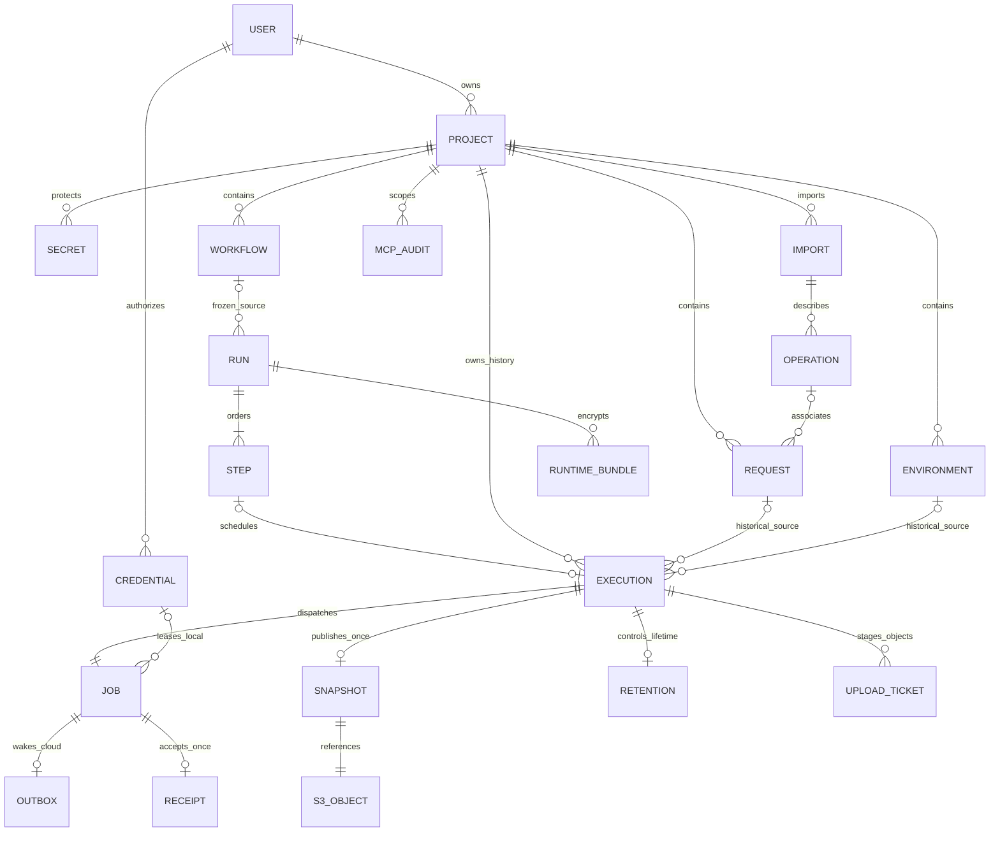

# W1 DynamoDB data model

Status: revised direction authorized; implementation details **proposed for
Davian Hernandez's review**, 2026-10-06. Replaces the proposed PostgreSQL model,
not deployed data. See [system design](w1-system-design.md),
[review decisions](w1-review-decisions.md), and
[proposed ADR 0002](../decisions/0002-serverless-persistence-topology.md).

## Tables, keys and ownership

Propose two DynamoDB Standard on-demand tables in one region/stage: `Control`
for non-secret metadata and `Protected` for encrypted values. Both have string
PK/SK. Transactions span both tables. No global tables, DAX, LSIs or provisioned
capacity initially. Protected has no indexes or stream. API, execution,
dispatcher and cleanup roles have separately reviewed permissions; MCP has no
AWS role or direct table access.

Use opaque random UUIDs, server timestamps, schemaVersion, ownerId, projectId
and nonnegative versions. Below `P=P#<projectId>`, `U=U#<userId>`. Every project
child in both tables uses P. Verify identity, strongly read P/META, and enforce
owner/state on every operation. Cross-user IDs return not_found; nested
resource/project references must agree. Queue IDs locate authoritative jobs,
never authorize them. No project ownership transfer in MVP.

Verified `(Cognito issuer, sub)` maps to an application user through
`PK=IDENTITY#<SHA256(length-prefixed issuer/sub)>`, `SK=META`. Store/compare the
exact issuer/sub defensively. Create mapping and random U/META using conditional
puts in one transaction. Email is not an identity key; Cognito alone holds login
credentials. Conditional U/AGENT_SLOT enforces one active local credential.
Tokens contain opaque credential ID plus 256-bit secret proof; raw tokens are
returned once, stored as digests, never used as table/index keys.

### Item catalog

All items are Control unless marked Protected. References are logical, **not
foreign keys**. The shared transaction protocol enforces same-project/live
references. Historical IDs remain strings after definition deletion.

| Entity                   | PK / SK                                    | Required data and constraints                                                                                                                            |
| ------------------------ | ------------------------------------------ | -------------------------------------------------------------------------------------------------------------------------------------------------------- |
| User                     | U / META                                   | issuer/sub, disabled, version, safe display metadata; no passwords/tokens                                                                                |
| Agent/MCP credential     | U / CRED#id                                | type, tokenHash, expiry/revokedAt/version; agent activeJob/lease slot; capability scope                                                                  |
| Project gate             | P / META                                   | ownerId, active/deleting/deleted state, version/deletionEpoch, storageReservedBytes, inflightCount, safe name                                            |
| Submission receipt       | P / IDEM#purpose#keyDigest                 | private normalized-input HMAC, execution/run ID, seven-day retry window; conditional unique put, explicit expiry                                         |
| Request                  | P / REQ#id                                 | revision, ordered query/header arrays, typed body, secret refs/redaction rules, optional operation refs; complete configuration <=64 KiB, item <=128 KiB |
| Environment              | P / ENV#id                                 | revision, ordered unique-name variable descriptors, secret refs; <=32 KiB                                                                                |
| Saved secret             | P / SECRET#id (Protected)                  | scope/source revision, locator, ciphertext envelope, revoked flag; <=8 KiB plaintext, <=16 KiB envelope                                                  |
| Import manifest          | P / IMPORT#id                              | preparing/ready/deleting state, revision, sanitized S3 pointer/hash, dialect/warnings; <=100 operations, <=2 MiB source                                  |
| Operation                | P / OP#importId#operationId                | method/path, source operationId, local schema refs; <=32 KiB bundle; no remote refs                                                                      |
| Workflow                 | P / WF#id                                  | revision, ordered steps, request IDs, extraction/assertion rules; 2–10 steps, <=64 KiB total                                                             |
| Run                      | P / RUN#id                                 | frozen non-secret plans/source revisions, state/version, currentPosition/failedPosition, completedAt/normalExpiresAt, pinnedCount/availableCount         |
| Run step                 | P / RUN#id#STEP#00                         | pending/queued/running/completed/failed/skipped, exact input-binding refs, execution ID, safe outcome/evidenceExpired                                    |
| Run input/runtime bundle | P / RUN#id#INPUTS or OUTPUT#00 (Protected) | encrypted initial inputs or immutable producer-step output version/provenance; <=32 KiB envelope each                                                    |
| Execution anchor         | P / EXEC#id                                | frozen non-secret plan/source revisions, runId/position, jobId, submittedAt, state/version; complete frozen configuration <=64 KiB, item <=128 KiB       |
| Job                      | P / JOB#id                                 | executionId/target, queued/claimed/running/completed/failed, attempts/fence, leaseId/nonceHash/credentialId, dispatchIntentAt/executeNotAfter/deadline   |
| Job bindings             | P / JOB#id#BINDINGS (Protected)            | <=32 KiB encrypted submission-time bundle; exact source IDs/revisions                                                                                    |
| Snapshot manifest        | P / EXEC#id#SNAP                           | insert-only safe summary, S3 key/checksum/bytes, evidence version, outcome/exact nullable httpStatus, completedAt, replay secret refs                    |
| Retention                | P / EXEC#id#RET                            | version, pinned/pinnedAt, immutable normalExpiresAt=completedAt+30 days, cleanupState live/deleting                                                      |
| Local result receipt     | P / JOB#id#RECEIPT                         | original credential, accepted lease/fence/nonceHash, canonicalizationVersion, HMAC keyId/digest, acceptedAt; insert-only, no payload                     |
| Status event             | P / EXEC#id#EVENT#0001                     | sequence/safe transition, <=10 per execution, no bodies/variables                                                                                        |
| Outbox                   | P / OUT#jobId                              | stable identifier-only message, dueAt, attempts, delivery lease/version, publishedAt                                                                     |
| Upload ticket            | P / UPLOAD#id                              | writer execution/lease/fence, deletionEpoch, exact S3 key, byte reservation/write deadline, pending/published/orphan/deleting/settled                    |
| Maintenance work         | P / WORK#kind#id                           | deletion/revocation/cleanup cursor/version/dueAt; no raw payload                                                                                         |
| MCP audit                | P / AUDIT#time#id, or U for account-only   | credential/tool, sanitized bounded inputs/outcome; account-only expiry 90 days                                                                           |

Account/stage items outside project partitions: `PK=STAGE#id/SK=QUOTA`
holds versioned monthly admission, inflight and byte reservation counters;
`PK=STAGE#id/SK=META` holds active/recovering state, fresh recoveryGeneration
and actual restore timestamp(s)/reconciliation status. Jobs, OUT, leases and
upload tickets carry generation; admission/dispatch/publication conditions
check current active generation. Stage guards count toward action budgets.
No separate independently preserved deletion journal is required. P/META
tombstones remain for normal deletion coordination, not guaranteed across restore.

Mutable evidence availability is separate from immutable SNAP: RET has
evidenceAvailability=available/unavailable_missing/unavailable_corrupt.
Restored historical manifests keep captured outcome/checksum untouched; no
missing S3 body is fabricated. Availability does not extend normal retention.
Restored jobs have operational recovery_interrupted failure metadata without
invented upstream response. Terminal history need not match current generation
to be read after reconciliation; old-generation work can never dispatch.

Saved-request and per-execution frozen configurations each have a complete
serialized <=64 KiB cap, including URL/headers/query/body descriptors/references/
policy/schema/serialization overhead. This is separate from item and protected
bundle caps. Reject invalid saved writes and oversize frozen submission plans.
Resolved outbound body independently <=64 KiB after interpolation; validate
before any target HTTP. Wire-read and decompressed response caps each 2 MiB;
exceeding either fails capture with omission metadata. Complete encoded
evidence/API/local-upload cap stays 4 MiB. No external large-request-body store
or S3 request-body references in MVP. Future increases require review of item,
transaction, transport, memory/CPU limits.

S3 evidence is sanitized typed JSON/text, not a DynamoDB body blob. Ordered
arrays preserve duplicates; exact supported non-secret body text is distinct
from parsed JSON views. Ordinary structures contain masks/refs. Crypto envelopes
include key ARN, wrapped data key, nonce/tag, algorithm/version and opaque
context IDs. Bind AEAD/KMS context to app/stage/project/binding/purpose; no user
values or names in CloudTrail-visible context. Re-encrypt copies for destination
scope. Runtime values are never historical reusable secrets.

## Logical relationships

The ERD shows logical relationships, not SQL enforcement. All project children
are partitioned by P; objects use a stage/project S3 prefix.

## Access patterns and indexes

Control has three sparse **KEYS_ONLY** GSIs; Protected has none. Index storage
and writes are costed. Fixed-width timestamp/UUID encodings are delimiter-safe.
GSI reads are eventually consistent, never authoritative for authorization,
lease/pin/readiness/deletion. Discovery requires strong base reads and conditions.
[AWS GSI guidance](https://docs.aws.amazon.com/amazondynamodb/latest/developerguide/GSI.html).

| Pattern                             | Key/index/order                                           | Authoritative check                                                         |
| ----------------------------------- | --------------------------------------------------------- | --------------------------------------------------------------------------- |
| User/credential/project detail      | Direct GetItem U/META, U/CRED#id, P/META                  | Strong owner/state/token proof                                              |
| Owner projects                      | GSI1 LPK=U#id#PROJECT, LSK=createdAt#id                   | Strong project gates; hide deleted                                          |
| Project definitions/imports/runs    | GSI1 LPK=P#id#type, LSK=createdAt#id                      | Active project/detail; import ready only                                    |
| Project execution history           | GSI1 LPK=P#id#EXEC, LSK=submittedAt#id                    | Gate/anchor/RET/SNAP/run view                                               |
| Frozen request history              | GSI3 HPK=P#id#REQ#sourceId, HSK=submittedAt#executionId   | Survives request deletion; same checks                                      |
| Failure/target/pin filters          | Hydrate/filter bounded history candidates                 | <=5 query pages/request, possibly empty items with nextCursor; no full scan |
| Execution/job/receipt/evidence      | Direct keys in authorized P                               | TransactGet gate/anchor/RET/SNAP/run where needed                           |
| Ordered run steps                   | Strong Query P, begins_with RUN#id#STEP#                  | Gate/run version before/after; retry mixed views; <=10 steps                |
| Local queued candidates             | GSI2 DPK=AGENT#credentialId, DSK=createdAt#jobId          | Credential/slot/project/job/run grant transaction                           |
| Outbox/stalled jobs/cleanup/tickets | GSI2 DPK=kind#shard, DSK=dueAt#id, eight hash shards/kind | Strong item state/version/due checks; lag changes latency, not safety       |
| Project deletion                    | Strong Query P in both tables; S3 ListObjectsV2 prefix    | Tombstone/drain cursor; no GSI completeness assumption                      |
| MCP audit                           | Base Query P/U, AUDIT# prefix                             | Owner/scope/logical expiry                                                  |

Opaque IDs alone cannot locate partitions: proposed execution/job routes carry
projectId in path/query. No global unowned resource locator. This needs contract
review. Internal messages include projectId as locator, never ownership proof.

GSI2 has one due-kind per item: JOB local-queued or lease-reconcile, OUT publish,
RET execution-cleanup, RUN summary-cleanup, UPLOAD orphan-check, WORK drain.
Transitions replace/remove due keys atomically. A committing handler may issue
one bounded best-effort identical identifier notification immediately after
cloud submission/successor commit. OUT stays durable/unpublished until scheduled
publication, so fast and scheduled sends may duplicate but never create jobs.
Queue uncertainty never rolls back committed acceptance. GSI absence never proves no
work exists. Durable outbox/work items plus minute/hourly schedulers recover
missed discovery; parent deletion uses base queries. Project/run counters and
bounded base reads, not an index query count, determine deletion eligibility.

Collections: limit 25/default, 100/max, descending fixed timestamp+ID; HMAC
cursor binds owner/project/type/filter/index, initial high-water key,
LastEvaluatedKey and 24-hour expiry. Validate contents, never arbitrary table
expressions. AWS may stop a Query at 1 MiB before limit; filtered pages can be
empty with a cursor. High-water is **not snapshot isolation**: lag may omit
late-visible entries; refresh first page to reconcile. No offsets/total count.
Batch status accepts <=25 IDs and coherent per-execution reads.

## PostgreSQL guarantees mapped to DynamoDB

Every project mutation includes exactly one P/META Update with condition
`ownerId=expected AND state=active AND version=v`, incrementing version. Read v,
prepare outside DB, commit or re-read/revalidate using fresh time and jitter.
This is optimistic per-project serialization instead of FOR UPDATE. Never
retry HTTP on conflict. Only drain transactions allow state=deleting with the
matching deletionEpoch/version. Credential checks/updates join where required.
Require STAGE/META active with matching recoveryGeneration on execution
admission/claims/grants/publication/OUT delivery. Operator-only reconciler paths
may mutate under state=recovering while product dispatch remains disabled.
Normalize by table/PK/SK: combine each item's changes into **one** action;
ConditionCheck plus Update on the same item is invalid. No external I/O in DB.

| Prior PostgreSQL guarantee              | DynamoDB equivalent                                                                                                                                       |
| --------------------------------------- | --------------------------------------------------------------------------------------------------------------------------------------------------------- |
| Project lock + parent-first child order | Shared gate CAS + run/job/RET versions in one transaction; sorted keys for reproducibility, no lock order/SKIP LOCKED                                     |
| Same-project ownership FKs              | Trusted partition construction, gate ownership, conditional live-reference/revision checks; no generic unconstrained writes                               |
| Unique snapshot/job/step/receipt        | Deterministic run-step execution/job IDs and attribute_not_exists conditional puts                                                                        |
| Consistent source revision set          | TransactGet or version-checked reads, followed by gate/source conditions on submission                                                                    |
| Atomic finalization/next scheduling     | One transaction for manifest, encrypted outputs, job/step/run, receipt, RET and successor/OUT; preuploaded S3 object invisible until publication          |
| Derived protection under gate           | Transactional pinnedCount/availableCount and <=10 RET version checks before summary deletion                                                              |
| Project cascade                         | Atomic deny-access tombstone followed by bounded resumable table/S3 drains; physical deletion is **not atomic**                                           |
| Immutable snapshot grants/trigger       | Dedicated conditional Put-only publication path, no evidence Update endpoint, reviewed role permissions/tests; IAM alone cannot enforce item immutability |

[AWS transactions](https://docs.aws.amazon.com/amazondynamodb/latest/developerguide/transaction-apis.html)
allow 100 distinct actions/4 MiB, individual items <=400 KiB. The ten-minute
ClientRequestToken window does not replace retained application receipts.

## Bounded transactions and workflow limits

Proposed application caps: **80 actions, 2 MiB aggregate, 128 KiB/item**, with
lower entity caps above. Count serialized items, attribute names, envelope
expansion and condition actions before acceptance; reject oversize before HTTP.
Workflow: 2–10 sequential steps, no loops/branches, eight outputs/step,
2 KiB/output, eight secret inputs/step, <=32 KiB encrypted bundle, <=256 KiB
total frozen plans/initial bindings. Deduplicate/limit to 16 distinct live input
sources across the run; workflow/request/environment/source checks <=18 total.
Otherwise reject before accepting the run. At most ten output bundle versions.

| Transaction boundary  | Planned maximum distinct actions | Atomic result                                                                                                                           |
| --------------------- | -------------------------------: | --------------------------------------------------------------------------------------------------------------------------------------- |
| Standalone submission |                             <=24 | Gate, <=16 source checks, anchor/job/bindings/idempotency/OUT                                                                           |
| Run creation          |                             <=60 | Gate, <=18 source checks, run/ten steps/one input bundle, first job/anchor/bindings/OUT, idempotency                                    |
| Local grant           |                             <=12 | Credential slot, gate, job/anchor, run/step/event and source checks                                                                     |
| Step finalization     |                             <=60 | Gate/credential, current job/anchor/step/run, SNAP/RET/ticket/receipt/event, output, successor job/anchor/step/bindings/OUT and sources |
| Terminal finalization |                             <=60 | No successor; <=9 skipped steps, <=10 runtime deletes, initial-input/current-bindings deletion                                          |
| Execution cleanup     |                             <=24 | Gate/run/step, RET/anchor/SNAP/receipt/job/bindings/events/OUT; ticket remains through S3 cleanup                                       |
| Pin/unpin             |                              <=8 | Gate/run counters, RET and quota/context guards; never SNAP                                                                             |

Jobs additionally retain internal recovery ownership/version when a trusted
reconciler fences expired intent to publish an unknown failure. Recovery can
resume without a live agent credential; it never accepts late client evidence
or creates an accepted-upload receipt. See the system dispatch protocol.

These are budgets for future transaction-builder tests, not generated code.
The local-grant row's <=12 is the small-source case; its concrete full-source
ceiling is **30 actions**, never omit a source check to fit twelve. Dispatch
validates every live source under the gate; frozen ciphertext cannot bypass
deletion/revocation. Fail the run if a required input is gone.

Project/account deletion, bulk dependent-job cleanup, whole-history deletion
and 100-operation imports/generated requests **cannot fit in one transaction**.
Commit authoritative deleting/revoked/preparing state first, then chunks of
<=50 mutations plus guards, <=2 MiB, with durable cursor/retry. All paths check
parent/source state. Import chunks are invisible until ready; final publication
conditions counts/digest/version. Interrupted imports resume or drain. Workflow
finalization is never silently split. Account deletion is not an MVP route.

## Conditional retention and workflow context

Time predicates use a validated server decisionTime, refreshed for every new
CAS attempt and recorded with the operation. DynamoDB has no transaction NOW()
predicate: do not claim millisecond-precise wall-clock expiry at remote commit.
Propose denying new pins within five seconds of expiry to absorb ordinary
clock/latency uncertainty; resolve uncertain commits before changing decisionTime.
Authorization for a pin is evaluated at that decisionTime; cleanup ordering is
still enforced by gate/RET conditions. This timing boundary needs Davian's
review and slow-commit/clock-skew tests. Ordinary reads apply current logical
expiry; a physically retained expired record is not otherwise available.

Pin/unpin, execution cleanup, summary cleanup and project deletion use the same
gate/version protocol. RET starts live at finalization; availableCount increments
in that transaction. Pin transitions alone change pinnedCount. Cleanup atomically
sets live -> deleting, removes logical availability, decrements availableCount,
marks step evidenceExpired and schedules S3 deletion. Conditions prevent double
decrement. Metadata/ticket persist until object deletion settles.

Pin requires terminal, cleanupState=live and already pinned or normalExpiresAt

> fresh now; required frozen run context must exist. Unpin restores **original**
> completedAt+30 days, never a new grace period. Already pinned/unpinned is
> idempotent while the anchor exists. An expired unpinned body cannot be resurrected.
> Never modify SNAP/body/checksum when pinning.

Context is needed while any step is pinned **or logically available**. Before
summary deletion strongly read all <=10 RET entries, then condition their
versions, gate and run in one transaction; require normal run expiry and no
protection. availableCount can include expired-but-not-cleaned entries, so it
alone cannot decide logical retention; reconcile expired steps first. Context
reads evaluate those <=10 pin/expiry entries transactionally. Context contains
only non-secret order/source IDs/safe outcomes, no response copies/runtime
ciphertext. Last unpin after run expiry hides that expired body and otherwise-
unneeded context immediately. An available sibling protects context, not body.

Concurrent pin/cleanup contend on gate/RET: first valid commit wins; loser
rechecks fresh time/state. Pin cannot reverse deleting; cleanup skips new pins.
Summary cleanup conditions the same versions so cannot orphan pinned context.
Project deletion changes state/epoch first and overrides every pin.

Do **not** put native TTL on live executions/SNAP/RET/runs/receipts/secrets/
project tombstones/upload tickets. TTL bypasses the gate and deletes asynchronously
within days; removing TTL during pin is not transactional protection. Use explicit
due-index cleanup and logical expiry. TTL is only optional reclamation for
already invalidated nonauthoritative ephemeral items.
[AWS TTL behavior](https://docs.aws.amazon.com/amazondynamodb/latest/developerguide/TTL.html).

## Definition deletion, protected data and rollout

Request/environment deletion commits a deleted/version marker first; dispatch
and successor preparation check source state, so dependent queued work fails
without bulk atomic fencing. Drain scoped secrets/bindings in chunks. Preserve
frozen source IDs/plan/schema/evidence and project ownership; live associations
report deleted. Reruns use current stable secret refs and fail if missing: no
historical recovery or name-based fallback. Workflow deletion preserves frozen
runs; unstarted runs fail, started runs continue subject to source revocation.
Import deletion preserves captured schema/hash. Saved definitions survive history
cleanup. Already delivered secrets cannot be recalled.

See [S3/project deletion](w1-system-design.md#s3-publication-orphans-and-project-deletion).
Keep a minimal permanent P/META tombstone: opaque project/owner ID, deletion
epoch/timestamps only, no names/configuration/evidence. Never reuse project UUIDs.
All children/pins/secrets/bundles/receipts/imports/audits/objects drain; account
credentials remain for other projects during normal operation. Proposed seven-day
PITR/on-demand backup residual differs from active deletion; individual projects
cannot be selectively erased from those copies.

**Davian-selected recovery exception:** an earlier restore can bring back later
deleted projects/items and lose later changes. P/META tombstones may themselves
roll back; no claim that deletion survives every restore and no independent
deletion journal solely for anti-resurrection. Communicate actual UTC restore
times for both tables and the rollback/deletion warning. Reconcile Control,
Protected and current private S3 before opening stage ingress/dispatch. Mark
missing/corrupt S3 evidence unavailable outside SNAP; quarantine broken references
and encrypted inputs, rebuild counters, never invent response bodies.

Before reopening, assign a fresh recoveryGeneration and suppress every restored
OUT. Fence/terminalize restored queued/claimed/running jobs and unstarted
successors as recovery_interrupted; stop affected runs, clear lease/credential
slots and remove unusable runtime bundles in bounded guarded transactions.
A restored queued plan may already have executed after its restore timestamp,
so even absent restored intent cannot justify automatic HTTP. Only deliberate
new submissions/reruns create executable new-generation work. Deny old local
credentials/results pending re-pairing; old SQS identifiers/generations remain
non-executable. Retain historical terminal SNAP/receipts without rewriting them.
The [restore procedure](w1-system-design.md#backup-restore-and-recovery-exception)
defines readiness checks and normal-operation deletion cleanup continuation.

Davian owns future versioned entity codecs/data-change tools; SST owns reviewed
table/index/IAM/PITR definitions. Use additive schemaVersion readers, conditional
backfills and explicit index readiness, not startup SQL migrations or a full-model
implementation. Preserve Compose PostgreSQL/spikes/accepted SST ADR as historical
foundations until separately authorized cleanup. Future tests need actual DynamoDB
transaction semantics plus local fixtures; mocks cannot prove GSI lag, TTL,
throughput, S3 races, IAM or restore. None were run by this documentation task.
