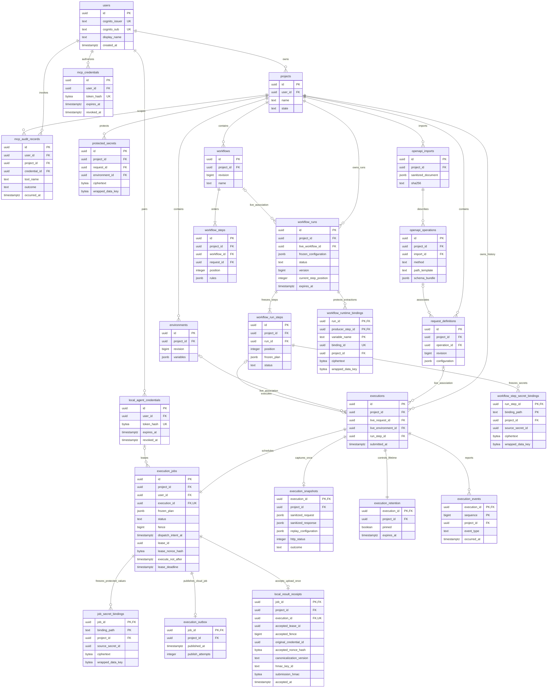

# W1 PostgreSQL data model

Status: proposed for Davian Hernandez review, 2026-10-05. This is a logical
schema specification, not SQL migrations. Names are internal snake_case;
HTTP fields remain lower camelCase and opaque string IDs. See the
[system design](w1-system-design.md) and [review decisions](w1-review-decisions.md).

Revised from `c311e74`. Dispatch receipts, versioned workflow outputs and the
locking protocol below are **proposed for Davian Hernandez's review**; no schema
has been migrated or executor implemented.

## ERD

The diagram shows durable ownership and principal relationships. Nullable live
associations are outside frozen evidence. Every project child has a direct
`project_id` FK even when that edge is omitted for diagram readability.

`cognito_issuer` and `cognito_sub` form **one composite unique key**, not two
individually unique columns. ERD `UK` labels denote membership in that key.
An execution has one job and retention row, enforced by creation in one
transaction; a final snapshot exists only once terminal. A workflow contains
two or more steps (the diagram's one-or-more edge cannot express that minimum).

## Common keys and ownership constraints

Use application-generated random UUIDs, `timestamptz`, nonnegative `bigint`
revision/counter fields, bounded `text`, and explicit CHECK constraints for
statuses/targets/methods. Avoid PostgreSQL enum types initially so adding a
reviewed status does not require enum-specific rollback handling. All rows
with `id` have primary keys and timestamps unless identified as join rows.

`projects.user_id REFERENCES users(id) ON DELETE CASCADE`. Every project-owned
table has `project_id NOT NULL REFERENCES projects(id) ON DELETE CASCADE`.
Give referenced project-child tables `UNIQUE(project_id, id)`. Use composite
FKs `(project_id, parent_id)` for associations to prove same-project membership,
including job/execution, environment, workflow step/request, import/operation,
run/step, and secrets. Nullable live links use `ON DELETE SET NULL (parent_id)`
so `project_id` stays intact. Account-scoped credentials reference users with
cascade, and never infer ownership from a job message.

PostgreSQL supports composite constraints and
[column-specific SET NULL](https://www.postgresql.org/docs/17/ddl-constraints.html).
An FK does not create an index on its referencing columns: index each FK used
by deletion or joins. Owner checks are mandatory in API queries even when
composite FKs validate writes. Proposed MVP uses explicit ownership queries
and scoped DB grants; PostgreSQL RLS can be reviewed later, with connection
pool identity handling proved before relying on it.

## Table descriptions

| Table                       | Required fields and constraints beyond common keys                                                                                                                                                                                                                                                                                                                        | Lifecycle                                                                                                                                                                                               |
| --------------------------- | ------------------------------------------------------------------------------------------------------------------------------------------------------------------------------------------------------------------------------------------------------------------------------------------------------------------------------------------------------------------------- | ------------------------------------------------------------------------------------------------------------------------------------------------------------------------------------------------------- |
| `users`                     | `cognito_issuer`, `cognito_sub`, `display_name`; UNIQUE(issuer, sub). No login password, token, or email-based identity key.                                                                                                                                                                                                                                              | Upsert only after verified Cognito identity. Account deletion is not an MVP route.                                                                                                                      |
| `projects`                  | `user_id`, name 1–120 characters, state active/deleting, revision. Name need not be unique.                                                                                                                                                                                                                                                                               | Root ownership/deletion boundary.                                                                                                                                                                       |
| `request_definitions`       | Name, method CHECK GET/POST/PUT/PATCH/DELETE, revision, `configuration jsonb`, nullable operation FK. Configuration contains URL template, ordered query/header arrays, JSON/text body descriptor, sensitive path policy, and secret references only.                                                                                                                     | Mutable saved configuration; unaffected by execution cleanup.                                                                                                                                           |
| `environments`              | Name, revision, `variables jsonb` ordered array; unique enabled variable names within each environment validated on write; secret references replace protected values.                                                                                                                                                                                                    | Mutable; absence means no environment rather than implicit default.                                                                                                                                     |
| `protected_secrets`         | Stable ID, nullable owning request/environment links with at most one set, binding locator, value revision, ciphertext, nonce/tag, wrapped data key, key ARN, algorithm/version, revoked_at. No plaintext or plaintext fingerprint.                                                                                                                                       | Project-level secrets may have neither child link. Request/environment-scoped rows cascade on child deletion; project secrets survive child deletion. Unique binding locator within the selected scope. |
| `executions`                | Submitted timestamp, nullable live request/environment/run-step links, nullable `rerun_of_id` SET NULL within project. Captured source IDs/names belong in frozen plan/snapshot, not these live links. Unique non-null run-step association.                                                                                                                              | History anchor owned directly by project. Child-definition deletion clears live associations only.                                                                                                      |
| `execution_jobs`            | UNIQUE execution_id; target cloud/local; local credential ID when local; status queued/running/completed/failed; frozen_plan, plan schema version/hash, owner-scoped idempotency key/hash, attempt_count, lease_owner/id/nonce hash/deadline, execute_not_after, fence, dispatch_intent_at, started_at/completed_at.                                                      | Operational mutable state; plan immutable after enqueue; lease/status updated by narrow procedures. Terminal state cannot reopen.                                                                       |
| `job_secret_bindings`       | PK(job_id, binding_path), source secret ID/revision, encrypted value copied at submission, crypto metadata as above. Source ID is a logical reference, not a cascade FK.                                                                                                                                                                                                  | Runtime-only protected payload; deleted at terminalization or source revocation. Never selected by evidence readers.                                                                                    |
| `execution_snapshots`       | PK execution_id; evidence version, frozen source IDs/names, target, sanitized resolved request/response, error, timing, assertions, validation results, schema hash/version, redaction version, replay_configuration, sanitized evidence hash. outcome completed/failed; http_status NULL or 100–599; duration_ms >= 0; completed_at NOT NULL >= started_at when present. | Insert once. No UPDATE permission or mutable retention fields. Source identifiers inside the payload are historical strings, not live FKs.                                                              |
| `execution_retention`       | PK execution_id; pinned default false, pinned_at/by nullable, expires_at nullable until terminal; version for concurrency. At terminal CHECK: pinned implies expires_at NULL, otherwise completed_at + 30 days maintained by procedure.                                                                                                                                   | Mutable retention, independent of snapshot. Pin/unpin never edits evidence.                                                                                                                             |
| `execution_events`          | PK(execution_id, sequence), event type CHECK contract's four event names, occurred_at, minimum safe status/httpStatus payload. Sequence increases under execution row lock.                                                                                                                                                                                               | Append only; retained with execution. No raw configuration, responses, or secrets.                                                                                                                      |
| `execution_outbox`          | PK job_id, next_publish_at, attempt count, published_at. Message generated from trusted relational identifiers, not arbitrary stored JSON.                                                                                                                                                                                                                                | Dispatcher updates metadata; cascade with execution/project. Only cloud jobs have an outbox row.                                                                                                        |
| `openapi_imports`           | Detected version, parser version, sanitized_document or future artifact reference, sanitized document hash, status ready/failed, warnings and unsupported features JSON.                                                                                                                                                                                                  | Immutable successful import; reimport creates new ID. A hash covers sanitized content, not secret-bearing uploaded bytes.                                                                               |
| `openapi_operations`        | Import FK, method/path_template, optional document operationId, schema_bundle JSONB/hash; UNIQUE(import_id, method, path_template). Document operationId uniqueness checked when provided.                                                                                                                                                                                | Immutable operation version. A request's operation link may change; a queued execution captures the schema bundle.                                                                                      |
| `workflows`                 | Name, revision, stop_on_failure default true.                                                                                                                                                                                                                                                                                                                             | Mutable definition, direct project child.                                                                                                                                                               |
| `workflow_steps`            | Workflow FK, request FK, positive position, rules JSONB for extraction/expected status/property assertions; UNIQUE(workflow_id, position) deferrable for reordering.                                                                                                                                                                                                      | Request FK RESTRICT; API deletion first removes affected step rows and marks the workflow invalid if fewer than two remain. Workflow deletion cascades definition steps.                                |
| `workflow_runs`             | Nullable live workflow FK, frozen configuration/revision, status queued/running/completed/failed, failed_step_position, timing, version/current_step_position, normal history expires_at.                                                                                                                                                                                 | Immutable configuration, mutable orchestration. Project-owned; workflow deletion clears live link.                                                                                                      |
| `workflow_run_steps`        | Run FK, positive position, frozen non-secret plan, status pending/queued/running/completed/failed/skipped, safe assertion/extraction summaries; UNIQUE(run_id, position).                                                                                                                                                                                                 | Frozen steps independent of live definitions. Execution association through executions.run_step_id; no circular mandatory FK.                                                                           |
| `workflow_runtime_bindings` | PK(run_id, producer_step_id, variable_name), immutable encrypted extraction version, taint/type/crypto metadata. Next plans reference exact producer versions; all extracted values use protected storage.                                                                                                                                                                | Inserted atomically with successful step finalization; deleted only at terminal run or project deletion. Never in run-history outputs.                                                                  |
| `local_agent_credentials`   | User FK, opaque credential ID, SHA-256 digest of 256-bit random token, name, created/expires/revoked/last_seen timestamps. Token type prefix supports routing, not authority. UNIQUE token_hash.                                                                                                                                                                          | Raw token returned once. Partial UNIQUE(user_id) WHERE revoked_at IS NULL; expired predecessor revoked transactionally before replacement.                                                              |
| `mcp_credentials`           | Same random-token hash model, user FK, expiry/revocation, scope read:evidence only.                                                                                                                                                                                                                                                                                       | Separate from agent execution tokens; proposed stdio authentication route needed. Multiple clients allowed.                                                                                             |
| `mcp_audit_records`         | User FK; nullable project and credential FKs; tool name, bounded correlation ID, safe target ID/type, outcome allowed/denied/error, timestamp, duration. No raw tool arguments or returned evidence.                                                                                                                                                                      | Append only. Project-scoped rows cascade at project deletion; unscoped listing/denied calls retain no project content. Credential deletion SET NULL.                                                    |

`workflow_step_secret_bindings` has PK `(run_step_id, binding_path)`, direct
project/run-step cascade FKs, logical source secret ID/revision, and the same
envelope crypto columns as job bindings. At run submission it freezes protected
values for **every** step, before any step job is created. When a step becomes
eligible, create its execution/job and transfer/re-encrypt bindings atomically;
skipped steps get no execution. Destroy unused bindings on run termination,
source revocation, or project deletion. Index `(project_id, source_secret_id)`.
This prevents later-step secrets from silently changing during a run.

Prepare ciphertext/rewrapping before opening the finalization transaction, then
install the prepared next-job bindings atomically after checking run version and
fence. There is no KMS/network call while holding finalization locks. Runtime
binding versions have a same-project/run producer-step FK with cascade, an
index `(project_id, run_id, producer_step_id)`, and no UPDATE capability. Resolve
variable overrides at advancement by selecting the latest **completed producer**
in frozen step order, then store exact version references in the next plan.
Plaintext extraction is never part of a snapshot; protected values are carried
in the local upload's dedicated execution-runtime envelope if executed locally.

Add UNIQUE(project_id, run_id, id) to run steps and a matching composite producer
FK on runtime bindings so provenance cannot point to a step from another run.
Every binding also has an opaque unique binding_id for crypto context/version
references; user-controlled variable names never enter plaintext KMS context.
Reject duplicate output variable names within one step's frozen extraction rules.

`local_result_receipts` has project/job/execution cascade FKs; UNIQUE execution_id
and PK job_id enforce one accepted upload. Require the job/execution pair to
match via a composite unique key/FK. Accepted lease/fence/nonce hash, original
credential ID, HMAC key/version/digest and acceptedAt are insert-only. Original
credential ID is captured metadata, not a mutable live FK. Digest keys remain
available until receipts referencing them are cleaned up (including pins).
No payload, extracted value or secret fingerprint is kept in a receipt. The
receipt HMAC authenticates canonical submission bytes, separately from the
sanitized evidence hash. The [upload protocol](w1-system-design.md#local-result-creation-versus-duplicate-acknowledgment)
defines acknowledgment after lease expiry and denial after credential revocation.
Unknown-outcome reconciler records do not create accepted-upload receipts.

`executions.run_step_id` uses same-project SET NULL on step deletion so run
summary cleanup cannot remove pinned execution evidence. The job's live local
credential association is nullable and SET NULL on credential deletion; capture
its original ID in the frozen plan and require a live valid credential at claim.
The API ordinarily revokes credentials rather than physically deleting them.
Revocation destroys pending bindings and fences leases in the same transaction.

Jobs carry a redundant trusted `user_id` to enforce UNIQUE(user_id,
idempotency_key) for non-null submission keys. Add UNIQUE(user_id, id) to
projects and an additional `(user_id, project_id)` FK to jobs referencing that
key; a message cannot change either value. Project ownership transfer is not
an MVP operation. Deletion procedures examine captured source identifiers in
pending job/run-step plans before clearing live links, so a deleted request or
environment also invalidates unstarted frozen work without rewriting history.

Each binding ciphertext is rewrapped/re-encrypted for its **destination scope**;
do not blindly copy ciphertext bound to a different encryption context.
Bind AEAD/KMS context to app, stage, project ID, binding ID, and purpose. The
data model's crypto columns denote one envelope, never stored plaintext keys.
Scopes are non-secret identifiers; labels and user-supplied values stay out of
KMS context and CloudTrail. Runtime DB roles cannot enumerate the secret table
through generic list APIs; execution-scoped retrieval verifies owner/job/lease.

## JSON versus relational storage

Relational columns own identity, authorization, joins, status, ordering,
retention, and deletion. JSONB owns versioned variable-shaped request fields,
assertion rules, sanitized response structures, and OpenAPI schema bundles.
Use arrays for headers/query so duplicates and order survive; a JSON object
would collapse duplicate keys. Represent raw sanitized JSON/text bodies as a
text string inside a typed body descriptor when preserving whitespace/number
spelling matters; JSONB parsed views are optional, not exact-wire substitutes.
[PostgreSQL JSONB](https://www.postgresql.org/docs/17/datatype-json.html)
normalizes object representation and is not a byte-for-byte archive.

All JSON has a schema version, validated shape, nesting/size caps, and no raw
secret values. Version hashes cover canonical **sanitized** content only.
Redacted snapshots preserve exact non-secret content within configured limits;
omit unsupported/oversized bodies with explicit omission metadata rather than
claiming complete capture. Response validation runs on supported bounded
in-memory content and stores only sanitized violation details.

Schema associations and limits/redaction policy are frozen before execution.
An import edit/delete cannot change old contract-validation results. Reject
remote `$ref` fetching initially; local document references only, with cycle,
depth, and resource limits. Examples containing credentials are removed before
storage or generated request creation. The library-selection card must define
supported OpenAPI versions and dialects; this model does not imply universal
OpenAPI 3.x support.

## Indexes and transactional constraints

- Projects: `(user_id, created_at DESC, id DESC)` for keyset pagination.
- Definitions/environments/imports/workflows: `(project_id, created_at DESC, id DESC)`;
  composite parent references indexed. Unique environment name per project is
  optional UX, not required for resolution by ID.
- Executions: `(project_id, submitted_at DESC, id DESC)` and
  `(project_id, live_request_id, submitted_at DESC, id DESC)`; separate frozen
  source request ID column/index if history must be grouped after deletion.
- Snapshots: `(project_id, outcome, completed_at DESC, execution_id DESC)` for
  failed-history/MCP filters; partial failed index if volume warrants it.
- Jobs: partial `(status, lease_deadline)` for queued/running reconciliation;
  `(target, status, created_at)` for agent claims; UNIQUE scoped submission
  idempotency key where present. Include project FK index independently.
- Outbox: partial `(next_publish_at, job_id) WHERE published_at IS NULL`.
- Receipts: unique execution/job keys; `(hmac_key_id)` for key-retirement checks;
  direct project FK index. Keep until execution cleanup, not just lease expiry.
- Retention: partial `(expires_at, execution_id) WHERE pinned = false`.
- Protected bindings: `(project_id, source_secret_id)` for revocation;
  protected secret owner/scope indexes and uniqueness on locator. No ciphertext
  indexes, plaintext fingerprints, or speculative JSONB GIN indexes.
- Workflow steps/run steps: unique parent/position, FK request/run indexes;
  run history `(project_id, created_at DESC, id DESC)`.
- Audit: `(user_id, occurred_at DESC, id DESC)` and project FK index.
- Credentials: unique token digest, user index, one active agent constraint.

Cross-table CHECK constraints cannot inspect other rows. Procedures/transactions
enforce terminal snapshot/job agreement, one retention row per execution,
expiry calculation, same owner for agent assignment, secret locator validity,
monotonic transitions, and minimum two valid workflow steps. Definition writes
use revision compare-and-swap; submission reads/locks a consistent revision
set. Workflow reorder/delete is atomic. Proposed owner-scoped idempotency keys
live on jobs until history deletion; after expiration replay is not guaranteed.

Add step state `queued` to the proposed pending/running/terminal/skipped CHECK.
Add a partial UNIQUE(local_credential_id) for running local jobs to enforce one
unresolved lease per agent; poll checks this under the credential lock and
returns empty/busy until terminalization. A local claim requires a non-null
valid credential association even though historical live links may be nulled.
`workflow_runs.version` and current_step_position change only in the locked
advancement transaction. UNIQUE executions.run_step_id and UNIQUE jobs.execution_id
prohibit multiple job identities per step. A run's `expires_at` is its immutable
normal summary expiry, assigned once at run termination; pin protection is
derived from linked execution_retention rows, not an independently updated
counter or an extension to that normal deadline.

Poll commits running state, lease identity/nonce hash, executeNotAfter and
dispatch intent together before executable delivery. Finalization commits
snapshot, accepted local receipt where applicable, output binding versions,
step/job/event/retention state, run advancement and next execution/job/outbox
in one transaction. Skipped successors have no execution rows. At final run
termination destroy runtime/unused step bindings in that same transaction.
Ordinary pre-terminal lease loss is not permission to discard variables for
later steps; only terminal run finalization deletes them. Unknown lease outcome
fails the step/run through the same procedure, rather than rescheduling HTTP.

## Immutability, retention, and deletion

Revoke UPDATE on execution_snapshots and add a defensive reject-update trigger.
Worker inserts only through finalization with fencing checks. Grant deletion
only to reviewed project-deletion/retention procedures and the migration owner;
immutability prevents edits, not authorized removal. Execution identity and
frozen plans are also write-protected after submission. Mutable live links,
jobs, run progress, and retention occupy separate tables.

Hourly cleanup discovers up to 500 candidate IDs without child-row locks, then
uses the shared parent-first protocol below. Never lock a retention candidate
before its project/run. Delete an eligible execution anchor, cascading snapshot,
job, receipt, bindings, outbox, events and retention. Reads filter expired
unpinned records immediately, including receipts unavailable through ordinary
evidence reads. Queue/running jobs have no result expiry; stalled-job
finalization gives failed results completedAt and the normal 30-day expiry.
Saved definitions and secrets are never execution-cleanup targets.

### Shared locking and retention transactions

**Proposed for review:** serialize all product state mutations within a project
using `projects FOR UPDATE`. This deliberately trades per-project write
concurrency for straightforward MVP correctness. No external I/O is allowed
inside these transactions. Ordinary authorized reads need not take these locks.
Read evidence/context from one consistent MVCC view and apply logical expiry;
generic table writes cannot bypass the gated procedures.
Use one global order, never upgrade a previously acquired weaker lock:

1. Original local credential FOR UPDATE, only for poll/upload/revocation.
2. Project rows FOR UPDATE, ascending UUID for multi-project operations.
3. Workflow-run rows FOR UPDATE, ascending UUID.
4. Run-step rows FOR UPDATE, ordered by run ID, position, then UUID.
5. Execution anchors FOR UPDATE, ascending UUID.
6. Retention rows FOR UPDATE, ascending execution UUID.
7. Job rows FOR UPDATE, ascending UUID; then receipt/event/outbox/binding writes.

Pre-discover identities with unlocked reads, acquire parents, then revalidate
relationships/state under locks; retry discovery if relationships changed.
Acquire sets at each level in that order, not repeated child-first loops.
Credential revocation locks its credential first, then affected projects/runs
in sorted order, fences pending jobs and destroys bindings; project deletion
does not revoke account credentials shared with other projects. If locking
many projects becomes costly, keep the credential revoked while fencing is
completed in ordered transactions; every execution path must still reject it.

Cleanup uses SKIP LOCKED on **project gates**, then locks relevant descendants
in order, rechecks all predicates and uses one fresh server clock value after
acquiring locks for expiry decisions. Do not use stale transaction-start time
after waiting. Batches are capped at 500 deletions, grouped by project/run;
rollback/retry a group on lock timeout. PostgreSQL recommends consistent lock
ordering to avoid deadlocks; see
[explicit locking](https://www.postgresql.org/docs/17/explicit-locking.html).

| Operation                | Checks and writes in its transaction                                                                                                                                                                                                                               |
| ------------------------ | ------------------------------------------------------------------------------------------------------------------------------------------------------------------------------------------------------------------------------------------------------------------ |
| Pin                      | Lock project/run/step/execution/retention in order; require terminal, still-available evidence and required live workflow context. Set pinned=true, expiry=NULL and pin metadata. Existing pin is idempotent. Run protection is derived under the same gate.       |
| Unpin                    | Same locks; set pinned=false and original completedAt+30 days. If last pin and normal run expiry passed, context becomes eligible only when no other available step needs it; there is no new 30-day grace period. Return retention metadata from this commit.     |
| Execution cleanup        | Same locks; recheck terminal, unpinned and expired. Clear the run step's live evidence reference and set safe evidenceExpired summary, then delete execution/receipt/body. Preserve required run context without copied bodies.                                    |
| Workflow-summary cleanup | Lock project/run/steps and linked anchors/retention in order; require terminal run, normal run expiry passed, no pinned steps and no still-available step evidence. Delete only summary/step rows, clearing nullable links; never delete a pinned body indirectly. |
| Project deletion         | Lock project first, then affected descendants in order; mark deleting, deny writes/claims, fence pending jobs and cascade every project child, including pins, receipts, runs and secrets. Commit before reporting active-store deletion complete.                 |

The project gate stabilizes the linked-retention query; a separate pinned-count
cache is unnecessary. Run context is effectively retained while any step is
pinned **or still available**, even if its normal deadline has passed. It
contains frozen non-secret step order/IDs and safe outcome/assertion summaries,
not response copies, extracted values or runtime ciphertext. Expired unpinned
bodies are hidden immediately and cleaned independently while context remains.

Concurrent pin and cleanup linearize at the gated expiry/state recheck. A pin
on still-eligible evidence that commits first protects its context/body; cleanup
rechecks and skips it. If evidence/context has expired or cleanup wins deletion,
pin returns not_found and cannot resurrect rows. Summary cleanup cannot observe
zero pins midway through a pin transaction. On last unpin after normal run
expiry, expired body and otherwise-unneeded context become logically unavailable
at commit; either cleanup ordering later yields the same result. Another
still-available step continues to protect context, but does not protect the
expired unpinned body. Project deletion wins by denying later mutation and
deleting everything regardless of pinning. Snapshots never change in these races.

| Deletion trigger                              | Preserve                                                                                                            | Remove or revoke                                                                                                                                                                                           |
| --------------------------------------------- | ------------------------------------------------------------------------------------------------------------------- | ---------------------------------------------------------------------------------------------------------------------------------------------------------------------------------------------------------- |
| Request deletion                              | Project-owned execution snapshots and frozen replay plans; run history. Clear live request links.                   | Request-scoped protected secrets, queued bindings referencing them; unstarted jobs tied to the deleted request fail clearly. Remove live workflow steps using request; validate workflows before new runs. |
| Environment deletion                          | Execution snapshots' captured environment ID/name/non-secret context and run history. Clear live environment links. | Environment variables and protected secrets; fail queued jobs requiring that environment. Reruns never silently substitute another environment.                                                            |
| Workflow deletion                             | Frozen runs/steps and executions; clear live workflow link.                                                         | Definition and definition steps. Proposed unstarted run fails with workflow_deleted; in-progress run follows its frozen plan unless project/secret revocation intervenes.                                  |
| Import deletion, if a later route is approved | Captured schema bundle/hash and validation results in executions.                                                   | Import/operation definitions; clear live request association. No delete route exists yet.                                                                                                                  |
| History cleanup                               | Request/environment/workflow definitions; project secrets; workflow step ordering.                                  | Expired unpinned execution anchor and evidence. Run-step live execution link becomes NULL, with safe summary indicating evidenceExpired. No duplicate body in workflow history.                            |
| Project deletion                              | Account-scoped user and credentials usable for other projects.                                                      | Every project child, pinned/unpinned evidence, secrets/bindings, imports/operations, workflow definitions/runs, events, outbox, and project-scoped audit rows. Fence workers and deny stale submissions.   |

For workflow history, propose unpinned run summaries expire 30 days after run
completedAt too. A run with any pinned step execution retains its safe run/step
summaries until the last pin is removed, no other available step requires them,
and normal run expiry has passed, or until project deletion. Expired unpinned
step bodies still disappear; references must report expiration. This prevents
workflow storage from bypassing execution retention and requires an explicit
contract addition. Do not cascade execution deletion to a whole workflow run
or preserve expired response copies inside run summaries.

Source IDs inside snapshots and replay references are immutable metadata even
after deletion. Project ownership remains enforced by executions.project_id,
so nulling a live request/environment FK never creates ownerless history.
No FK from a snapshot to a mutable definition can block project deletion.

## Migration ownership and rollout

Propose versioned SQL under `services/api/migrations/`, maintained by the
backend owner Davian Hernandez and reviewed in PRs. A separate one-shot
migration command/task uses a DDL role, records version/checksum/applied_at,
and obtains a PostgreSQL advisory lock. Run once before compatible API/worker
rollout; do not run schema changes on every service startup. The spike's
startup migration proves a mechanism only; do not reuse its table or master
DB user as product policy.

Runtime roles are separate API, worker, cleanup, and audit capabilities;
no runtime CREATE/ALTER/DROP. Use expand/backfill/contract changes, checksum
validation, transactional DDL where supported, and reviewed data rollbacks.
Introduce tables as slices need them, starting users/projects, rather than
migrating this entire future model immediately. Local Compose and CI use the
same migrations. Tests must exercise same-project composite FKs, cross-user
authorization, immutable updates, cleanup/pin races, deletion cascades, and
schema upgrades on PostgreSQL 17. Backups and a restore rehearsal precede
destructive schema changes; production recovery remains untested here.
