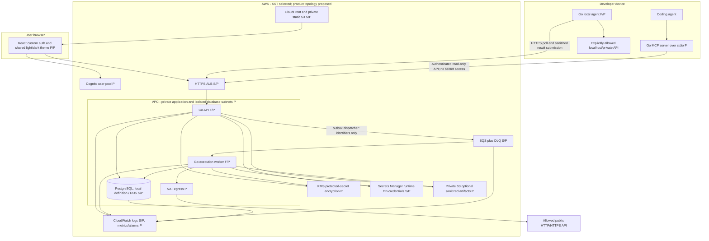
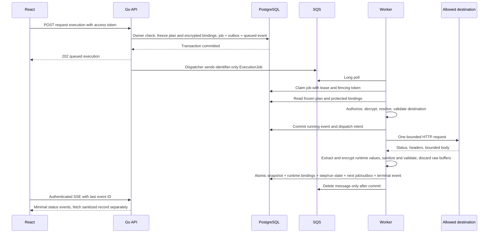

# W1 system architecture and execution design

Status: proposed for Davian Hernandez review, 2026-10-05. This is a design
deliverable, not implemented behavior or deployment evidence. New settings,
routes, tables, and topology below require review before implementation.
Read alongside the [data model](w1-data-model.md) and
[decision sheet and contract gaps](w1-review-decisions.md).

Revision baseline: `c311e74` on `docs/w1-architecture-data-model`, with a clean
working tree. All revised protocols and the
[monthly cost comparison](w1-review-decisions.md#monthly-development-cost-estimate)
remain **proposed for Davian Hernandez's review**. Accepted SST/Cognito and
product security/retention decisions remain distinct. No linked contracts,
Trello cards, capstone proposal, or accepted ADR are changed by this revision.

## Source baseline and repository evidence

All three linked sources were read through connected apps:

- [Architecture task](https://trello.com/c/jbm6BuxP/2-w1-finalize-architecture-and-data-model):
  implementation-level diagrams, ownership, deletion, retention, migration
  ownership; Davian acceptance is required for Done.
- [API Contracts v0.1](https://docs.google.com/document/d/1KSfRYOb2UxmrIl8VoFjc3YP38-PMu7k_fM9wrVkEenM/edit):
  proposed interfaces and agreed cross-cutting decisions; routes are not
  implemented until code and tests exist.
- [Working proposal](https://docs.google.com/document/d/1tatrrhqytTxAZxlrOnbSQRymmqjL2MmGq7Tdj0-1T60/edit):
  MVP includes cloud execution, local execution, OpenAPI, workflows, and MCP.

Repository inspected at `aab7d65`: root [AGENTS.md](../../AGENTS.md),
[overview](README.md), [accepted SST ADR](../decisions/0001-sst-infrastructure-candidate.md),
[both completed spike phases](../spikes/sst-viability.md), `sst.config.ts`,
`compose.yml`, service entry points/tests, frontend, and verification scripts.
No nested AGENTS.md was found. The starting tree was clean on `codex` with a
GitHub remote. This draft uses `docs/w1-architecture-data-model`, following the
task's explicit branch instruction over AGENTS.md's general `codex` rule.

| Evidence                         | Actual boundary of what exists                                                                                                                           |
| -------------------------------- | -------------------------------------------------------------------------------------------------------------------------------------------------------- |
| React/Vite and three Go services | Landing page; API/worker health handlers; local agent binds loopback. No product auth, executor, MCP, or database integration.                           |
| Docker Compose                   | PostgreSQL 17 local development definition, not evidence of product persistence.                                                                         |
| Compute/frontend SST spike       | Observed Fargate, ALB, SQS send/receive, CloudFront/S3, redeploy, diff, state, teardown. No product worker consumption.                                  |
| Database SST spike               | Observed private encrypted RDS PostgreSQL 17.10, exact-secret access, verified TLS, spike-only migration/CRUD, temporary non-root role, teardown.        |
| Current cloud state              | Reports record removal of application stages; shared SST bootstrap and RDS service-linked role remained. This task did not query or mutate AWS.          |
| Not tested by spikes             | Product authorization, sanitization, retries, retention, production egress, recovery/restore, rotation, Cognito, SSE, local polling, MCP, CI federation. |

## Proposed topology

`F` means a local process foundation exists; `S` means an isolated spike proved
that infrastructure capability and was removed; `P` means planned product work.
A combined label does not mean the product integration was tested.

The MCP server is a separate Go executable, initially alongside the local
agent distribution with stdio transport. It calls the hosted API; it has no DB,
SQS, KMS, or saved-secret access. The hosted API owns MCP invocation auditing.
Remote MCP hosting and OAuth resource-server behavior are a later reviewed
transport decision, not implied by this diagram.

Keep bounded sanitized evidence in PostgreSQL for the first execution slice.
CloudFront's private static S3 bucket contains compiled public assets only.
Private artifact S3 is a planned extension if measured import/evidence volume
requires it; it is not needed to launch bounded execution history. Avoid S3
Object Lock because project deletion must remove pinned evidence too.

### Authentication and ownership

Cognito remains the authentication provider beyond MVP. Use custom React
registration, verification/resend, sign-in, reset request/confirmation, and
sign-out screens sharing accessible light/dark theme components. The browser
auth SDK talks to Cognito directly; Kurier never stores login passwords. Use
a public app client without a client secret and a reviewed SRP-capable SDK
configuration; SST owns the pool, independently of the frontend SDK.

The API verifies bearer **access** tokens against its configured pool and app
client, then upserts the application user by `(issuer, sub)`. Email is neither
a database key nor ownership identity. Never accept a body-supplied `userId` as
authority. Resolve every project child through the authenticated user's
project. Cross-user identifiers return `not_found`; nested paths must match the
child's project. Jobs, environment, local agent, import operation, and workflow
references must belong to that same owner and project.

Workers trust database-owned jobs, not message-supplied owner identifiers.
MCP read tools and local poll/result endpoints use distinct credential scopes;
agent execution credentials cannot read arbitrary history or invoke MCP.
Ownership checks apply on each retrieval and result write, not only creation.

### Network and runtime privileges

Propose an HTTPS ALB in public subnets, private Fargate API/worker tasks with
NAT egress, and private RDS subnets with no internet route. API ingress only
from ALB; worker has no public listener. RDS permits 5432 only from the API,
worker, and one-shot migration task security groups. Use verified PostgreSQL
TLS with maintained AWS CA roots and small connection pools, initially five
connections per service replica. On-demand Fargate avoids Spot interruptions
in the first execution demo. Single-AZ RDS is proposed for the development
slice; commercial availability is a separate decision.

AWS documents both
[public task and private/NAT egress options](https://docs.aws.amazon.com/AmazonECS/latest/developerguide/networking-outbound.html).
NAT removes direct task addressing but adds fixed and traffic costs; it does
not enforce safe destinations. Public-IP tasks were tested only in the spike;
using them in product requires an explicit alternative proposal. VPC endpoints
can reduce AWS-service egress but cannot replace internet egress for arbitrary
public API testing. Start with one NAT for the development stage, documenting
its AZ dependency; production availability requires a separate cost review.

The cheaper proposed alternative places one API and one worker Fargate task
in public subnets with assigned public IPv4, removes NAT, and keeps RDS private.
API ingress allows its application port only from the ALB security group;
worker ingress is closed, including public health access. Restrict egress by
role, PostgreSQL to the DB security group, and credential/DNS access to required
runtime endpoints. Keep ECS Exec off; use container health checks for the worker.
Public addresses increase the consequences of security-group mistakes and
change on task replacement; they do not provide NAT's stable source address.
Both topologies require identical application DNS/IP, redirect, proxy, metadata,
size and timeout protections. This alternative is not acceptance of the spike
network as production infrastructure.

Separate API, worker, migration, and ECS execution roles. API sends SQS jobs;
worker receives/deletes/changes visibility on one queue. Allow only stage DB
credential-secret reads, stage KMS use, and needed bucket prefixes. Migration
role has schema DDL; application roles do not. Disable ECS Exec and raw HTTP
debug logs. SST links carry non-secret resource metadata, not decrypted user
secrets. CI should use GitHub OIDC and reviewed stage-scoped deployment roles.

### Sensitive data boundary

Saved sensitive configuration is deliberately persisted **only encrypted** in
the protected store. API ingestion replaces sensitive values with references
before saving ordinary request/environment JSON. Recognized credential fields
are protected even if the caller sets `sensitive: false`. UI reads return a
mask and reference, never a recoverable value. No reveal endpoint is proposed.
Names/descriptions/import examples also need validation against credential
material; metadata is not a loophole for secrets.

Plaintext is allowed transiently in authorized configuration writes and
execution runtime memory. Encrypted submission bindings freeze queued secret
values; these short-lived protected rows are distinct from captured evidence.
Only authorized worker execution, or a leased local job's TLS runtime envelope,
can decrypt them. Local polling must deliver execution configuration, including
required secrets, to the explicitly paired user-controlled device. That
necessary disclosure needs Davian's review of the job envelope; it is never
included in SQS, evidence, SSE, MCP, logs, telemetry, or persisted agent files.
The local agent must disable HTTP tracing and discard runtime values after use.

Redact Authorization, Proxy-Authorization, Cookie, Set-Cookie, recognized
credential headers/query fields, marked JSON paths/text fields, and resolved
sensitive variables. Carry taint through interpolation and workflow extraction;
mask the complete derived field if partial masking cannot be proved safe.
Scrub secret echoes from headers/body/URLs and structured diagnostics. Validate
JSON before path-based redaction. Unsupported encoding, binary content, or a
sanitizer failure yields a fixed failure record with body omitted. Arbitrary
transformations of secrets cannot be reliably detected; unknown sensitive
response paths require explicit user marking. The HTTP/redaction prototype
must prove supported encodings and fail-closed handling before persistence.

## Proposed execution sequence

1. Submission is a database transaction: authorize all resources, read a
   consistent request/environment revision, freeze ordered non-secret fields,
   selected operation/schema, assertions, limits, and redaction policy version.
   Copy selected saved-secret ciphertext into execution-scoped protected
   bindings. Create job, execution identity, queued event, and transactional
   outbox. Return 202 only after commit; queue-send failure is recoverable by
   the dispatcher. Reject missing secrets or invalid configuration before
   accepting where possible. API retries with the same proposed idempotency
   key and identical payload return the same execution; mismatched payload
   returns conflict. HMAC the canonical payload, including secret-reference
   identities, without recording raw submitted credentials.
2. The dispatcher sends the existing identifier-only ExecutionJob shape.
   Treat message `attempt` as advisory; DB attempt count and owner/target are
   authoritative. SQS is a wake-up mechanism, not the durable request payload.
   Database-based local polling claims local jobs; do not consume cloud SQS
   messages for local execution. Outbox publication is at least once.
3. Claim with an atomic row update/lock, lease deadline, and monotonic fencing
   token. Competing deliveries cannot claim an active job. A terminal job is
   acknowledged without performing HTTP. Verify live project, owner, target,
   credential state, and protected bindings again. API edits never cause a
   worker to reload the mutable request or environment.
4. Resolve the frozen plan with submission-time secret copies, in memory.
   A normal secret edit affects later submissions and reruns, not this job.
   Deleting a secret/environment/request revokes its queued bindings and fails
   pending execution clearly. Emergency secret revocation blocks pending
   use, including copied ciphertext. Rotation of encryption keys does not
   change the target credential value. Record only non-secret reference IDs
   and redacted fields in evidence.
5. Transition to running and persist dispatch intent before external HTTP.
   Validate destination at connect time; enforce [proposed limits](w1-review-decisions.md).
   No automatic retries of received 4xx/5xx, timeouts, or ambiguous network
   errors. A user rerun creates a new execution. HTTP 400–599 always means
   failed and preserves exact status and sanitized response; no response means
   null `httpStatus`. Propose completed for accepted 2xx/3xx unless assertions
   or validation policy fail; disabled redirects leave 3xx visible.
6. Extract workflow values from the bounded raw response **before** sanitizing
   and discarding it; encrypt runtime values separately. Atomic finalization
   inserts one sanitized immutable snapshot, terminal job/event and retention,
   plus workflow outputs, state and next scheduling intent where applicable.
   Destroy current-job protected bindings; keep run bindings needed by later
   steps until run termination. Enforce fencing and unique execution/run-step
   keys. Local duplicates acknowledge a retained acceptance receipt, not an
   expired live lease; no duplicate overwrites evidence or advances twice.
7. Acknowledgment happens after commit. If it fails, delivery repeats and finds
   a terminal job. Retry internal pre-dispatch DB/KMS/queue failures with
   exponential jitter, initially 1/2/4 seconds capped at 30 seconds, at most
   five claims. Start cloud SQS visibility/DB lease at 120 seconds; cloud workers
   renew every 30 seconds during finalization. Local leases use the fixed
   120-second window below, with no extension route. Queue long poll is 20 seconds. DLQ after
   five receives, queue retention four days, DLQ fourteen days. A reconciler
   fails stalled queued jobs after ten minutes, cleans bindings, and handles
   exhausted jobs; acknowledge/ignore old identifiers for deleted projects.

[SQS at-least-once delivery](https://docs.aws.amazon.com/AWSSimpleQueueService/latest/SQSDeveloperGuide/standard-queues-at-least-once-delivery.html)
requires database idempotency even with visibility leases.
[Visibility renewal](https://docs.aws.amazon.com/AWSSimpleQueueService/latest/SQSDeveloperGuide/sqs-visibility-timeout.html)
and [long polling](https://docs.aws.amazon.com/AWSSimpleQueueService/latest/SQSDeveloperGuide/sqs-short-and-long-polling.html)
are supported service mechanisms; the numeric settings here are Kurier proposals.

### External side effects and crashes

Database idempotency cannot guarantee exactly-once execution at another API.
After dispatch intent is committed, a worker crash could mean the request was
sent but the response was lost. On lease expiry, propose finalizing a failed
`execution_outcome_unknown` snapshot with no invented response rather than
automatically sending again. This can report unknown even if a crash occurred
just before send. A live worker holding a sanitized response may retry its
final DB commit within the lease; it must not resend HTTP. Reject late writes
after fencing changes. Inspect Go transport retry behavior and avoid reusable
connections for the MVP executor so automatic transport retry cannot bypass
this rule. Target-specific idempotency keys are future opt-in work.

### Local poll is the durable dispatch boundary

**Proposed default: commit dispatch intent before returning an executable local
job.** No separate start route is proposed. Intent means HTTP **may** have been
sent, not proof it was sent. Lost polls can therefore produce false unknown
outcomes; this conservative behavior avoids replay.

In one poll transaction, authenticate/lock the credential, then lock the project
and optional run using the [shared lock order](w1-data-model.md#shared-locking-and-retention-transactions).
Verify live owner/project/credential and eligible queued work. Set
`queued -> running`, increment fence, create random `lease_id` and nonce hash,
set `lease_deadline = grant_time + 120s`, `execute_not_after = grant_time + 30s`,
and `dispatch_intent_at = grant_time`. Append execution.running and update
workflow step/run state where applicable. Commit before returning configuration
and nonce; recheck revocation before disclosure where possible. Failure to
deliver/decrypt the envelope after commit must not clear dispatch intent.

The agent executes at most once per received `(jobId, leaseId, fence)` in its
current process, starts before executeNotAfter, and derives a conservative local
deadline from serverTime/remaining duration. It never restores executable jobs
from disk after restart. Repeated polls cannot return an already dispatched
job again; return empty/busy while that agent's one job remains unresolved.

| Failure boundary                                                          | Durable state and recovery                                                                                                                                                         |
| ------------------------------------------------------------------------- | ---------------------------------------------------------------------------------------------------------------------------------------------------------------------------------- |
| Server dies/transaction rolls back before poll commit                     | Job stays queued; no executable envelope was returned, so a later poll may claim.                                                                                                  |
| Commit succeeds but poll response is lost, or commit outcome is uncertain | Agent sends no HTTP without a complete response. Server reads job state; committed intent stays running and is never reassigned.                                                   |
| Agent crashes after receipt but before send, or executeNotAfter passes    | Intent remains ambiguous. At lease expiry finalize failed execution_outcome_unknown, with no replacement lease or HTTP retry.                                                      |
| Agent crashes during/after HTTP or loses result buffer                    | Same unknown finalization; no cloud fallback or reassignment.                                                                                                                      |
| Agent retains result but upload acknowledgment is lost                    | Retry the same upload packet, never HTTP, under the receipt protocol below.                                                                                                        |
| Lease expires without accepted result                                     | Reconciler locks/fences and finalizes unknown once; late original results cannot replace it.                                                                                       |
| Credential revoked                                                        | Serialize against poll/upload, fence pending leases, destroy bindings, and reject future poll/results including acknowledgment retries. Already delivered HTTP cannot be recalled. |

Poll includes leaseId/fence, executeNotAfter, deadline, serverTime and runtime
configuration. The nonce is stored only as a hash. Revocation after response
can race device execution: server access stops immediately, but an offline
device may still use a delivered secret/authorization. Unknown reconciliation
uses the workflow finalization transaction to fail the step and skip successors.

### Local result creation versus duplicate acknowledgment

Authenticate the currently valid **original** agent credential and owner/project
on every upload, then check a retained acceptance receipt before applying live
lease checks. The project-owned receipt (PK job_id, unique execution_id) stores
accepted lease ID/fence, credential ID, nonce hash, canonicalization version,
HMAC key ID/digest and acceptedAt. It stores no body or extraction values and
cascades with execution cleanup/project deletion. Keep its digest key until
all receipts needing it expire.

The **first** upload requires matching live lease/fence/nonce, unexpired lease,
running job, active project and valid credential. Atomically insert snapshot
and receipt, terminal metadata/event/retention, and any workflow advancement.
Server completion/receipt times are generated once. If commit acknowledgment
is lost, resolve by querying the receipt rather than executing HTTP again.

An **accepted duplicate** needs the same currently authorized credential and
retained lease identity/nonce, but does not need an unexpired lease or an active
job fence. These authorize acknowledgment only. Identical canonical digest
returns 200 with the original minimal receipt, without evidence writes, events,
variables or next jobs. Different digest or lease identity returns 409 conflict.
Revoked/expired credentials return 401 even for identical packets; replacement
tokens cannot inherit receipt authority. Deleted project/execution/receipt
returns not_found. No receipt plus expired/fenced lease returns conflict,
whether or not reconciliation has run. Unknown terminal snapshots have no
accepted-upload receipt; late uploads never reopen or overwrite them.

Propose RFC 8785 canonical JSON of the validated submitted DTO, authenticated
with HMAC-SHA-256 over a domain separator, schema version, job/lease identity
and content. Reject duplicate keys, nonfinite/unsafe numbers, unknown fields
and unsupported encodings. Define null/absent/default normalization in the
versioned DTO. Object whitespace/key order is immaterial; array order and body
text remain significant. Include agent timing and all extracted runtime values;
exclude server timestamps and server-generated random encryption nonces. The
private receipt HMAC is separate from the sanitized evidence hash and avoids
persisting public fingerprints of potentially sensitive values. Further server
redaction occurs once before snapshot persistence; duplicate comparison needs
neither old job secrets nor a newly changed sanitizer. The agent retains a
sanitized packet only in memory for retry; protected extracted values are also
memory-only, sent over TLS in a dedicated runtime-value write envelope.

### Reruns and workflows

Reruns copy historical non-secret replay configuration into a **new** job.
They resolve stored logical secret references against the current protected
store and capture new encrypted bindings. They do not decrypt a historical
snapshot or recover old secrets. A missing/revoked secret fails explicitly;
never silently choose another environment or a similarly named credential.
After request/environment deletion, non-secret history is readable and a rerun
is possible only when every required live secret reference remains available.

At workflow-run submission freeze all step plans and encrypted step-secret bindings, environment configuration,
extraction rules, assertions, and schema associations. Execute steps in order;
stop on HTTP, assertion, or configured validation failure. Extracted values
stay run-scoped, tainted when sensitive. To resume safely between jobs, persist
only encrypted protected runtime bindings and delete them at run termination;
ordinary run JSON contains masks/references. Each executed step gets the same
immutable snapshot shape. Skipped steps have no invented execution. Changing
the workflow or request during a run cannot alter its frozen steps.

### Atomic workflow finalization and advancement

**Proposed:** run creation freezes every step and protected binding and creates
only the first execution/job in one transaction. Step states are
`pending -> queued -> running -> completed|failed`; untouched successors become
skipped on failure. Run goes `queued -> running -> completed|failed`. Every
created job has one execution, unique by run_step_id; skipped steps have none.

Prepare finalization in memory before taking DB locks: parse bounded raw response,
evaluate assertions/validation and required extraction rules, carry sensitivity
taint, encrypt extracted values into immutable run-binding versions, sanitize
snapshot/error/diagnostics, and prepare next-step protected bindings and plan
references. **Extract before discarding raw buffers** because sanitization may
mask values needed later. No raw buffers or plaintext extractions enter logs,
evidence, queues or ordinary run JSON. Local agents perform extraction before
redaction and submit protected runtime values through the dedicated envelope;
the server validates/encrypts them rather than trying to recover them from a
redacted body. Unverifiable sensitive extraction is a trusted-agent limitation,
not a claim of server replay verification.

Missing required extraction, invalid path/type, failed assertion/HTTP/contract,
or inability to prepare secure bindings fails the step and skips later steps.
Precompute crypto/KMS work outside the DB transaction, bounded by the lease;
carry prepared ciphertext and expected run/job versions into finalization.
No network/KMS call is made while holding the finalization locks.

In **one PostgreSQL transaction**, using the shared lock order:

1. Recheck active project, valid local credential if applicable, matching fence,
   unexpired first-result lease, running step/job, expected run version and
   eligibility/non-revocation of prepared next-step bindings. Reject stale
   preparation; reprepare without HTTP replay while lease permits, or finalize
   a fixed safe failure when secure advancement is unavailable.
2. Insert the immutable execution snapshot and local acceptance receipt if
   applicable; set job/step terminal state, retention and terminal event.
3. For a successful step, insert encrypted extraction versions with provenance
   `(run_id, producer_step_id, variable_name)`. Reference exact versions in the
   next frozen plan, never a mutable latest-value lookup at worker dispatch.
4. If another step remains, change it pending -> queued, create its unique
   execution/job, install prepared protected bindings, and insert cloud outbox
   intent or a database-pollable local job. Increment run version/current step.
   Do not send SQS or deliver an executable local job inside this transaction.
5. For the last successful step, set run completed; on failure set run failed,
   record failed position and mark successors skipped. Set normal run expiry
   once, delete all runtime/unused step bindings on terminal run. Delete only
   the completed job's bindings if the run continues. Commit all or nothing.

Before commit, failure leaves no visible partial snapshot/variables/next job.
A live process may retry the same prepared transaction within its valid lease,
without resending HTTP. A process crash that loses the response before commit
leaves dispatch intent; reconciliation finalizes unknown/failed and schedules
no successor. After commit, a lost acknowledgment or crash is resolved from
terminal state/receipt; the committed next job and encrypted versions survive.
The outbox dispatcher retries publication, and local polling discovers committed
local jobs. Duplicate wakeups/step-finalizers cannot bypass unique run-step keys
or fencing, and a terminal duplicate never applies outputs or scheduling again.
Unknown commit outcomes must be read back before another transaction attempt.

The reconciler, ordinary worker and local upload route use this same
finalization procedure; no separately committed step-state update or volatile
callback is allowed to advance the run.

### Deletion and storage coordination

Project deletion dominates pinning, leases, and all associations. Mark project
deleting under lock, deny new reads/writes/claims, revoke bindings, and fence
in-flight jobs; then delete all project rows in a single transaction for the
bounded PostgreSQL MVP. A request already sent cannot be undone. Late worker
or local-agent results cannot recreate a deleted project.

Pin/unpin, execution cleanup, workflow-summary cleanup and project deletion
share the [project-first locking protocol](w1-data-model.md#shared-locking-and-retention-transactions).
Workflow context remains while any step is pinned or still available, without
copying response bodies. Last unpin after normal run expiry makes both expired
evidence and unprotected context logically unavailable at that commit; cleanup
later removes rows under the same locks. No operation can repin expired evidence
or resurrect deleted context. A deleting project overrides every pin.

If S3 artifacts are introduced, first fence writes and complete outstanding
bounded writes, then delete every object/version under the project prefix,
then cascade DB rows. Track retryable cleanup in a deletion job; report 204
only when active-store deletion is complete. This requires a reviewed async
deletion response if completion exceeds the HTTP budget. Do not rely on a
fixed bucket lifecycle that could erase pinned evidence. Restoring backups
must reapply project-deletion tombstones before serving traffic. Propose
seven-day DB backups and document the residual backup lifetime honestly;
instant physical erasure from backups is not established by this design.

## Monitoring and release checks

CloudWatch receives fixed diagnostic categories, request/execution IDs, status,
duration, and bounded counts only. Exclude full URLs, body/query/header values,
tokens, raw errors, and variable values. Expose Prometheus-compatible counters
and histograms internally; no external Prometheus service is needed initially.
Avoid user/project/execution IDs as metric labels. Propose alarms for DLQ > 0,
queue age > 120 seconds, stalled leases, sanitizer failures, deletion failures,
API 5xx rate > 5% over five minutes with a minimum 20 requests, and DB storage
below 20%. Proposed application log retention is 14 days.

Before each product slice, verify cross-user authorization, marked and echoed
secret exclusion, project-deletion races, duplicate delivery, frozen submission
behavior, immutable finalization, pin/cleanup races, and interrupted execution
semantics. The existing spikes do not satisfy these product tests.
