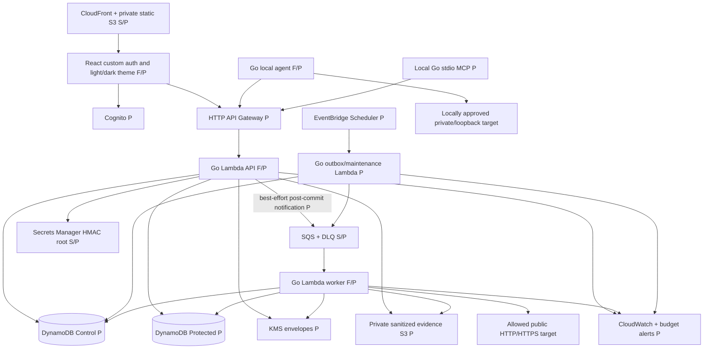
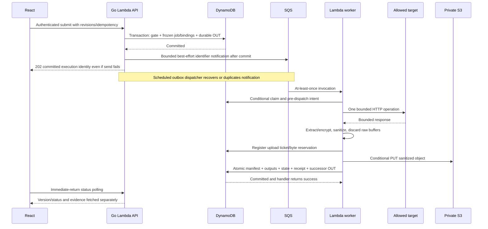

# W1 system architecture and execution design

Status: **Accepted by Davian Hernandez**, 2026-10-06, baseline `1fba942`,
including its documented defaults. New synchronization choices remain proposed
in the [acceptance record](w1-acceptance-sync.md).
Documentation only, not implemented/deployed behavior. See the
[DynamoDB model](w1-data-model.md), [decision sheet](w1-review-decisions.md),
and [accepted ADR 0002](../decisions/0002-serverless-persistence-topology.md).

## Sources and evidence boundary

Acceptance synchronization baseline: `1fba942` on
`docs/w1-architecture-data-model`, initially clean tree. The prior design
revision from `0fd9194` is preserved in Git history.
Read root [AGENTS.md](../../AGENTS.md); no nested instructions found. Explicit
feature-branch direction overrides the general codex-branch rule. Inspecting
current services/configuration confirms product persistence/execution is not
implemented. Preserve [accepted SST ADR 0001](../decisions/0001-sst-infrastructure-candidate.md)
and [completed spike reports](../spikes/sst-viability.md) unchanged.

The current external documents and authorized Kurier cards were read before
editing in place; unrelated content and native structure were preserved:

- [W1 task](https://trello.com/c/jbm6BuxP/2-w1-finalize-architecture-and-data-model).
- [API contracts v0.1](https://docs.google.com/document/d/1KSfRYOb2UxmrIl8VoFjc3YP38-PMu7k_fM9wrVkEenM/edit).
- [Working proposal](https://docs.google.com/document/d/1tatrrhqytTxAZxlrOnbSQRymmqjL2MmGq7Tdj0-1T60/edit).

See the acceptance record for synchronized sections and remaining proposed
wire/library choices and unassigned-card gaps. This is
an accepted design, not a deployed or runtime-tested product.

| Foundation                             | What is actually evidenced                                                                                              |
| -------------------------------------- | ----------------------------------------------------------------------------------------------------------------------- |
| React/Vite + Go API/worker/local-agent | Landing page and health/process foundations only; no product auth, executor, MCP or persistence                         |
| Local Compose PostgreSQL 17            | Local configuration, not product DB integration; retained unchanged                                                     |
| SST compute/static/SQS spike           | Fargate/ALB, queue access, static S3/CloudFront, redeploy/diff/state/teardown tested in isolation                       |
| SST RDS spike                          | Private encrypted PG17.10, exact-secret access, verified TLS, spike migration/CRUD, non-root deployment role, teardown  |
| Historical cloud inventory             | Reports record removed application resources and retained shared bootstrap; no live AWS audit in this revision          |
| New serverless topology                | Lambda, HTTP API, DynamoDB product transactions, publication, IAM, costs/performance/restore **not deployed or tested** |

## Revised topology

F = local foundation, S = removed isolated spike capability, P = planned
product behavior. Combined labels do not imply tested product integration.

SST 4 remains selected. Accepted components: ApiGatewayV2, Function, Dynamo,
Queue, Bucket, StaticSite and reviewed scheduler/KMS/Secrets Manager resources.
[SST HTTP API](https://sst.dev/docs/component/aws/apigatewayv2/) and
[Dynamo](https://sst.dev/docs/component/aws/dynamo/) document composition; verify
exact installed-version options/generated IAM in a separately authorized task.
Do not run SST diff/install/deploy here: first preview can mutate bootstrap.

Go uses aws-lambda-go and ARM64 provided.al2023 zip handlers, not an always-on
HTTP server/container. API 256 MiB/10-second timeout; worker 512 MiB/90 seconds;
maintenance 256 MiB/30 seconds; no provisioned concurrency. Cold starts and
actual memory/latency require measurements. AWS documents
[Go Lambda handlers](https://docs.aws.amazon.com/lambda/latest/dg/golang-handler.html).
No customer-VPC attachment, NAT, ALB, RDS or dedicated public IPv4 allocations.
Default Lambda networking reaches public endpoints; there is no stable outbound
IP or customer security-group egress policy. Keep AWS SDK and untrusted HTTP
transports separate. DNS/IP/redirect/metadata protections remain unchanged.
[AWS Lambda networking](https://docs.aws.amazon.com/lambda/latest/dg/configuration-vpc-internet.html).

Private static assets are public through CloudFront OAC. Evidence is a separate
private bucket, Block Public Access, TLS-only, SSE-S3, no Object Lock/versioning
initially, no CloudFront caching or public/presigned evidence URLs. Authorized
API reads proxy only published objects after checking owner/project/retention.
No blanket 30-day S3 lifecycle: it would erase pins. Protected values use KMS
application envelopes, never evidence bucket ciphertext as a secret store.

### Authentication, ownership and privilege

The separately authorized [users/projects slice](users-projects-contract.md)
implements a local HTTP adapter with verified fixture-token/DynamoDB Local
integration tests. It preserves `/healthz`, fails closed on missing runtime
Cognito configuration and has no production fixture bypass. Empty-project
cleanup is a runnable local command only; full cross-store cleanup and hosted
authentication/IAM/GSI propagation remain unvalidated. See [local setup](../development/local-ownership.md).

Cognito remains the provider beyond MVP; custom React signup/verification/
sign-in/reset/sign-out screens share accessible light/dark components. Public
client has no secret; credentials go directly to Cognito. API verifies access
token signature, issuer, client_id, token_use=access, expiry and allowed scopes;
reject ID tokens. HTTP API JWT authorizer can prefilter browser routes but does
not replace application token-use/ownership checks. Local/MCP routes authenticate
their separate opaque scoped credentials in the API; do not apply a Cognito-only
JWT authorizer to those routes. Disabled user/project/credential state is checked
on each request. See [verification recommendations](w1-review-decisions.md#authentication-and-email).

User identity is verified issuer/sub, never email or request-supplied userId.
Every resource is owner-authorized; projectId is a locator, not authority.
GSI results are hydrated/rechecked. MCP is a separate read-only stdio executable
calling an audited API bridge; no KMS/Protected/SQS/evidence-bucket permissions.
Hosted API commits bounded audit records before returning tool data, failing
closed if audit persistence fails. Remote MCP transport/OAuth is separate review.

Separate least-privilege API, worker, outbox and cleanup roles. Worker has no
public invoke URL; SQS event mapping invokes it. Outbox sends only one queue;
worker can send only the identifier notification for a committed successor,
never submit arbitrary new user plans. Cleanup can delete but not read
Protected plaintext. Static site role cannot read evidence. Use GitHub OIDC and
reviewed stage deployment roles; SST links carry resource metadata, not secrets.

### Secret boundary

Save reusable sensitive configuration only encrypted in Protected. Normal
definitions return masks/refs, never recoverable values. Protect Authorization,
Proxy-Authorization, cookies, recognized credential headers/query fields,
marked JSON/text paths and interpolated/extracted sensitive values regardless
of sensitive=false. No reveal endpoint. Plaintext exists only in authorized
write/execution memory and local execution-only TLS envelopes. Never include
secrets in logs, execution evidence, SQS, polling status, SSE, MCP or agent disk.

Freeze encrypted submission bindings separately from evidence. Current saved
secret edits affect new submissions/reruns, not queued work, except explicit
revocation/deletion. Dispatch checks live source state. Sanitize echoes in
URL/headers/body/errors; propagate taint. Unsupported encoding/binary/path
handling or sanitizer failure omits body with fixed safe diagnostics. Arbitrary
secret transformations cannot be detected reliably: explicit user response-path
marking and fail-closed supported encodings remain necessary.

## Accepted MVP size boundaries

Measure the **complete serialized saved request configuration** and **complete
serialized frozen configuration per execution** independently: each <=64 KiB,
including URL, headers, query fields, body descriptors, references, redaction/
schema metadata and serialization overhead. Reject invalid/oversize saved writes;
reject an oversize assembled frozen plan before accepting submission. Protected
bundles remain separately bounded and counted toward item/transaction/memory
limits. No large request-body S3 store or indirect body reference in MVP.

After interpolation/secret/workflow resolution, independently require outbound
body <=64 KiB before any target HTTP, on cloud and local execution. Recheck
resolved URL/headers/query under transport limits; an allowed stored template
cannot bypass the resolved-body bound. Response: separate <=2 MiB **wire-read**
and <=2 MiB **after decompression** limits; exceeding either is a Failed capture
with explicit omission metadata, observed status if available and no oversized
body persistence/extraction. Retain <=4 MiB complete encoded evidence/API/local
result envelopes, counting JSON escaping/base64/metadata. Sanitize safely and
omit as required to fit the envelope. Limit increases require review of full
DynamoDB item/transaction, HTTP API/Lambda transport and memory/CPU budgets.

## Execution sequence and dispatch

Submission returns 202 only after a transaction checks project/source revisions
and saves frozen non-secret plan/schema/limits/redaction policy, encrypted
bindings, execution/job, idempotency receipt and cloud OUT. Editing mutable
definitions cannot alter the queued job. Same owner/project idempotency key and
canonical input returns original identity within seven days; mismatch 409.
Do not persist literal keys/input credentials or public secret fingerprints.

### Accepted fast notification after commit

After the durable submission transaction commits, attempt **one** immediate
best-effort SendMessage with the same identifier-only payload as OUT. Use
a two-second operation deadline, SDK retries disabled on this fast path, and
skip unless remaining handler time exceeds that deadline plus one second for
response/cleanup. No background/unawaited send after Lambda returns. Read back
an uncertain DB commit before any send; unresolved submission commit follows
the idempotency/read-back protocol, not queue-failure rollback.

Send success, failure, timeout or uncertainty cannot reject a committed
execution, generate another job or erase its OUT. Return the original 202/
identity (or the existing identity on idempotent retry). The fast path deliberately
does **not** mark OUT published: scheduled delivery may send a duplicate even
after success, avoiding an extra publication transaction on the critical path.
The scheduled dispatcher and fast path may race; identical payloads/identities
and DB claim/fencing mean neither duplicate can authorize a second HTTP attempt.
Deletion/recovery may race a send: consumer gate/generation checks reject stale
identifiers. Schedule delivery remains the durable fallback.

Use the same opportunity after committing a workflow successor, in worker or
local-result API handler, only when time permits. Skip fast send if finalization
used the remaining budget; never trade snapshot/ACK correctness for latency.
Local jobs remain pollable, not SQS-dispatched. Aim for queue notification within
two seconds of commit when the fast path is available and SQS is healthy;
cold starts, throttling, worker concurrency, polling and failures prevent a
latency guarantee. Fast-send races/retries do not change upstream retry policy.

Outbox Lambda queries due OUT candidates, conditionally claims a short delivery
lease under the project gate, sends identifiers, then marks published. Crash
after send/before marking repeats notification, not HTTP. Minute scheduler plus
durable due index/cursors recovers queue outages; accepted backoff 1/2/4 seconds
to 60, failed publication retained, alert after ten minutes. No DB Streams
dependency or 24-hour stream replay assumption. Never drop an OUT after a
fixed retry count. Expired/deleted/terminal jobs can be acknowledged safely.

Cloud jobs: queued -> claimed with random lease/fence, deadline now+120 seconds.
Validate project/source state, decrypt/prepare, check destination, then commit
claimed -> running and dispatchIntentAt **before** HTTP. Claim failures before
intent can return to queued on expiry with a new fence, maximum five claims.
Any possibly committed intent is read back before proceeding; if uncertainty
cannot be resolved, do not dispatch. running may transition only to terminal,
never queued. One upstream HTTP attempt per job; no automatic replay after
timeout/network ambiguity/4xx/5xx. Inspect/disable Go transport retries and
reused connections for MVP. Exactly-once external effects cannot be promised.

Standard SQS batch size one, on-demand pollers, worker event mapping max
concurrency two, reserved worker concurrency two. Visibility **540 seconds**
(six times 90-second Lambda timeout), zero batching window, redrive after five
receives, queue four-day/DLQ fourteen-day retention. DB lease and SQS visibility
are different clocks. Worker finalization must finish before its 90-second
invocation/120-second lease; no heartbeat extension initially. Automatic SQS
retry only wakes the state machine. A pre-intent abandoned claim may retry;
post-intent expiry finalizes failed execution_outcome_unknown without new HTTP.
[AWS SQS/Lambda configuration](https://docs.aws.amazon.com/lambda/latest/dg/services-sqs-configure.html).

HTTP 400–599 is Failed with exact status and sanitized response. No response
means null httpStatus; assertions/required extraction/supported validation
failure also fail. Use 2xx/3xx completed unless those checks fail; redirects
off. Queued jobs older than ten minutes fail safely before dispatch. Unknown
lease reconciliation uses the same terminal transaction and skips successors.

Recovery finalization is an explicit exception to **first client result** lease
authorization, not a late result acceptance path. The trusted reconciler
conditions running intent + expired deadline + expected fence, increments the
fence and registers its own small safe-failure upload ticket under the project
gate. It publishes unknown only with that recovery fence and no accepted local
receipt; original worker/agent uploads now fail fencing. It may clear a matching
credential activeJob even if that credential is revoked. Reconciler crashes are
resumed from durable recovery ownership/ticket without target HTTP. A queued
timeout/source-revocation failure uses the same internal safe-finalization path
without live client credentials or decrypting removed bindings.

### Local polling is the durable dispatch boundary

No start route: **commit dispatch intent before returning executable work**.
Poll is immediate-return. Transaction checks live original credential/slot,
project/source state, optional run/step and queued job. Set queued -> running,
increment fence, save random leaseId/nonceHash, dispatchIntentAt, executeNotAfter
=grant+30 seconds and deadline=grant+120 seconds; update anchor/run/step/event
and credential activeJob. Commit before returning execution-only configuration,
nonce/serverTime/deadlines. Recheck revocation before disclosure where possible.
Lost response/decryption failure cannot clear committed intent.

At most one unresolved lease per agent. Repeated polls return empty/busy, never
the previously granted executable envelope. Agent uses conservative remaining
duration, starts once before executeNotAfter, never restores executable jobs
from disk after restart, and retains a result packet only in memory for upload
retry. Agent must not send HTTP on an incomplete response or ambiguous grant.

| Failure boundary                                                 | Transition/recovery                                                                        |
| ---------------------------------------------------------------- | ------------------------------------------------------------------------------------------ |
| Poll transaction rolls back before response                      | Remains queued; later grant is safe                                                        |
| Commit succeeds, response lost or commit uncertain               | Running intent stays; read back server state, no regrant                                   |
| Crash before/after target send, lost result, start window missed | At deadline finalize unknown once; no automatic replay/cloud fallback                      |
| Result commit ACK lost                                           | Retry identical upload, never target HTTP                                                  |
| Credential revoked/expired                                       | Credential state denies all poll/upload/ACK; bounded job fencing follows, even if GSI lags |
| Lease expires versus result race                                 | One conditioned terminal transaction wins; late response cannot replace unknown            |

Revocation first updates credential/version under the account slot protocol.
Grant/result transactions condition that same credential state/version; queued
work then drains through durable maintenance, not a giant multi-project
transaction. Revocation can fence access immediately but cannot recall HTTP or
a secret already delivered to an offline paired device.

### Local result creation versus duplicate acknowledgment

Authenticate the currently valid original credential and active owned project,
then transactionally read the retained receipt before live lease checks. First
result requires running job, matching lease/fence/nonce, unexpired deadline and
valid original credential. Publication/finalization inserts immutable receipt
and SNAP in the same transaction. Never reopen/overwrite terminal executions.

Identical accepted duplicate may return original minimal 200 acknowledgment
**after lease expiry**, using original credential and retained accepted lease/
fence/nonceHash. This grants ACK only, not a new write. Different digest/lease
409; revoked/expired credential 401, including identical retries; replacement
credential cannot inherit authority. Deleted project/cleaned receipt 404. No
receipt plus expired/fenced lease or unknown terminal 409. Keep receipt and HMAC
key while evidence remains, including pins; authorization rechecked on every ACK.

Canonicalize validated normalized DTO with RFC 8785, private HMAC-SHA-256 with
domain/schema/job/lease identity. Reject duplicate JSON keys, unknown fields,
unsafe/nonfinite numbers/unsupported encodings. Version null/absent/default
normalization; object key order/formatting insignificant, array order and body
text significant. Include agent timings and extracted runtime values, exclude
server timestamps/encryption randomness. No public fingerprint of sensitive
values. Compare duplicate packets under the accepted canonicalization version,
not a new sanitizer or recovered historical secrets. Dedicated TLS runtime-value
envelope is protected on receipt; agent pre-extracts before redaction. Server
cannot independently verify masked sensitive extraction: explicit trusted-agent
boundary. Local result payload cap 4 MiB includes encoding/envelope overhead.

## Atomic workflow advancement

Run creation transaction freezes all <=10 plans/source/schema/extraction rules
and encrypted input bundle, creates all step identities but **only first job**.
Steps pending -> queued -> running -> completed/failed; run queued -> running
-> completed/failed. Failure marks untouched successors skipped. Deterministic
run/position job IDs and conditional puts prevent a second execution per step.

After response, while raw bounded buffers still exist: evaluate supported
assertions/schema, extract required typed values and sensitivity provenance,
encrypt immutable producer-step output bundle, prepare next exact input refs,
sanitize evidence/diagnostics, then discard raw buffers. Extracting later from
redacted evidence would lose required values. All KMS/S3 work occurs outside
the transaction; local uploads supply memory-only extracted values over TLS.
Missing/invalid output fails the step; no successor. Encryption/publication
failure cannot advance a run or silently drop its variables.

One TransactWriteItems with expected project/run/job/source/credential versions:

1. Require active owner/project, running intent, live first-result lease/fence
   (or separately conditioned internal recovery ownership/fence), current step,
   source eligibility for successful advancement and registered uploaded ticket.
2. Conditional Put SNAP manifest and local receipt; update job/anchor/step,
   RET/event, settle publication ticket/reservation accounting.
   For local completion clear the credential's matching activeJob slot in the
   same transaction. A lost result acknowledgment cannot keep the agent busy
   forever; retained receipt still permits ACK retry, not repeated execution.
3. If continuing, Put immutable encrypted OUTPUT#position bundle, bound to
   producer/run. Queue next step and conditional Put deterministic next job/
   anchor/protected bindings/OUT (or local candidate). Advance run/version and
   reference exact output versions, never latest-value resolution.
4. If terminal, assign immutable normal run expiry, mark <=9 skipped steps,
   delete <=10 encrypted runtime bundles/initial inputs/current binding and
   decrement inflight count. If continuing, remove only finished job bindings;
   retain outputs still needed by later steps. Output preparation at final
   step is evaluated but need not persist a immediately-deleted bundle.
5. Commit all-or-nothing. No volatile callback or separate step status commit
   advances the run. No SQS send within the transaction.

Before commit: rollback exposes neither pointer nor outputs/successor. Live
process may retry prepared finalization within lease **without HTTP**. Crash
losing buffers leaves intent; reconciler publishes safe unknown failure and no
successor; preuploaded body becomes orphan. After commit: read terminal/receipt
on uncertain ACK; exact variables and OUT survive, dispatcher recovers next
notification. A committing handler may attempt the same bounded fast notification
for its successor; lost ACK/repeated notification still cannot advance twice.
Duplicate finalizers cannot republish/update outputs or advance
twice. Publication versus orphan cleanup shares ticket and project versions.
See [bounded transaction budgets](w1-data-model.md#bounded-transactions-and-workflow-limits).

Rerun creates new execution from frozen non-secret replay configuration and
**current** stable saved-secret references. Missing/revoked/deleted source fails
explicitly; never recover historical secrets or choose a similarly named value.

## S3 publication, orphans and project deletion

Objects use unique `stage/projects/<id>/evidence/<execution>/<ticket>.json`
keys; no user names/URLs. Conditional PUT If-None-Match prevents overwrite,
checksum is of sanitized content, server verifies key/bytes against ticket.
Bounded single PUT only, no multipart/presigned uploads initially.
[S3 conditional writes](https://docs.aws.amazon.com/AmazonS3/latest/userguide/conditional-writes.html).

Before every PUT (including retries), register an UPLOAD ticket in a gate/job-
guarded transaction with exact key, writer/fence, deletionEpoch, byte quota
reservation and write deadline. Never upload then register. Subsequent PUT
attempts require active parent/current ticket/live lease; same immutable key
is safe to retry only after resolving upload/commit uncertainty. S3 encryption
does not make an unpublished object authorized: API only follows committed
SNAP pointers after current authorization, never lists/reads tickets for users.

Successful PUT followed by finalization atomically marks ticket published and
inserts SNAP. Crash before PUT leaves a ticket without object; after PUT/before
commit leaves inaccessible sanitized orphan. Lost PUT response retains ticket
until outcome settled. Orphan sweeper first transactionally fences expired
pending ticket to orphan/deleting under gate/job conditions, then deletes exact
key, verifies absence and settles accounting. Publication loses if cleanup
fenced ticket first; published ticket cannot be orphan-cleaned. Never delete an
object based on a lagging GSI or missing manifest alone. Reconcile by strong
base reads. Cleanup must not release reserved bytes while a PUT may still land.

Project deletion is accepted **202 + deletion-operation status**, replacing
the original contract's synchronous 204:

1. One transaction changes P/META active -> deleting, increments version/epoch,
   writes durable drain WORK; retain a minimal P/META tombstone for normal
   deletion/upload coordination. No independently preserved deletion journal is
   required solely to prevent resurrection after restore. Immediately
   deny normal reads/claims/pins/submissions/publication. Already authorized
   response bytes/HTTP side effects cannot be recalled.
2. Drain jobs/OUT and protected data in bounded transactions, stop/fence writers,
   delete all referenced/unreferenced objects by strong project-prefix listing
   and tickets, and remove children from both tables. Pins never block deletion.
   Preserve tickets/work/tombstone until settled, not delete the evidence prefix
   once and assume success. Handler max lifetimes/deadlines bound new _attempts_,
   but a timed-out remote S3 PUT is still an uncertain outcome.
3. A writer that checked active **before** tombstone can PUT **after** deletion
   begins. Its publication transaction fails state/epoch; ticket remains visible
   to deletion drain, writer attempts immediate deletion, drain repeats exact-key
   deletion and prefix sweep after writer quiescence. Permanent tombstone means
   late uploads can never become accessible. No client presigned capability
   survives deletion; runtime IAM only permits reviewed application writers.
4. Claim physical completion only after writers quiesce, all tickets (including
   uncertain PUT outcomes) settle, both tables have no children, and prefix is
   empty. A lease timeout or one successful HEAD/empty LIST alone is **not proof**
   an in-flight PUT cannot finish later. Unresolved PUT keeps deletion draining
   and alerts for reviewed investigation; do not falsely report complete.
   Keep permanent tombstone and low-frequency residual-prefix sweeps even after
   completion to catch late objects. Internal deletion status is owned metadata;
   no evidence leaks through it. Tombstone protection applies to the active stage;
   an earlier backup may predate it and restore that deleted project.

Same ticket protocol covers sanitized import objects.
For import PUTs the guard is preparing import revision + project gate, rather
than a running execution lease; tickets still reserve exact keys/bytes and
publish only through the guarded ready manifest.
No Object Lock/indefinite version retention. If versioning is later enabled,
deletion must remove every
version and delete marker and costs must include them. Seven-day DB backups
and bootstrap backups may retain data separately. Project deletion is immediate
authorization revocation plus eventual physical deletion in normal operation,
not an atomic cross-service or backup erasure. The recovery exception below
does not weaken active-store fencing, orphan cleanup or access denial.

## Backup restore and recovery exception

**Davian-selected MVP policy, 2026-10-06:** restoring an earlier point may
restore projects/items deleted after that point. This is acceptable for MVP;
deletion does **not** survive every backup restore. Communicate actual restored
UTC timestamp(s), not just requested time, and warn: "Changes after this point
may be lost; deletions after this point may reappear." Include table-specific
times if Control and Protected differ, recovery completion time and evidence
availability report. S3 is not automatically rolled back with DynamoDB.

Use seven-day PITR plus a rotating weekly on-demand backup; residuals
exist until their backup retention ends, and are not project-selectively erased.
The backup expiry is seven days (about one live copy), not unlimited snapshots. No
independent cross-restore deletion journal is required. Keep normal-operation
project tombstones/tickets for coordination, but restoring their earlier state
can remove them. Present this warning in restore runbooks and user-visible
stage recovery notice, not as an unqualified permanent-deletion promise.

Before reopening, the **accepted recovery procedure** must:

1. Close ingress for product writes/polls/uploads, disable queue consumers and
   both fast/scheduled notifications and drain old handlers before cutover.
   Restore Control/Protected to operator-selected compatible points in new
   tables. Record each actual restore time. Review IAM, indexes, PITR and SST
   resource adoption; restoration does not imply ready operational configuration.
2. Create a fresh random stage recoveryGeneration in STAGE/META, state=recovering;
   all new jobs/OUT/tickets carry it. Consumer, local grant, upload, finalization
   and notification paths require active stage and matching generation in their
   conditions. Old queued SQS identifiers cannot select valid restored work.
   Do not reuse rolled-back numeric fences as cross-restore identity.
3. Reconcile Control references to Protected bundles, ownership, source versions,
   job/step/run relationships, pin counters, reservations and S3 tickets/manifests.
   Same-time restores are not assumed to preserve every multi-item/table
   transaction boundary. Quarantine inconsistent records and missing encrypted
   inputs; no plaintext fallback or silently changed credentials.
4. Suppress all restored OUT and terminalize **every restored nonterminal job**,
   including queued/claimed/running and unstarted workflow successors, as
   operational failed recovery_interrupted. Fence original leases, clear active
   credential slots, stop their runs/skip pending successors and remove protected
   runtime/input bindings through bounded reconciled transactions. Do not turn a
   restored queued job into a fresh executable job: it may have sent HTTP after
   the restore point even if its restored dispatch intent is absent. Retain
   historical terminal snapshots unchanged; never invent a target response for
   interrupted work. Require a deliberate new submission/rerun/new identity with
   current saved secrets. Normal pre-dispatch retries apply only to new-generation
   jobs, not restored work. Invalidate old local/MCP credentials for re-pairing;
   stale devices/results cannot regain authority through rolled-back revocation.
5. Check every published S3 pointer exists and matches checksum/size; mark
   missing/corrupt evidence as unavailable in separate mutable availability
   metadata, never fabricate body or rewrite captured outcome/hash. A restored
   deleted project can therefore reappear with unavailable history because S3
   deletion was not reversed. Objects without a valid restored manifest/ticket
   are inaccessible until classified for orphan/deletion cleanup. Pause destructive
   sweeps until this inventory is reconciled; resume tombstoned deletion drains
   only after matching writers/tickets are settled.
6. Recompute quota/retention/context counters from reconciled authoritative
   records; expire by original dates, not restore time. Complete an operator
   checklist confirming no eligible old-generation job/OUT remains, current
   permissions and storage policies are correct, and warnings/timestamps are
   published. Then set stage active for **new** work and enable consumers/
   notifications. Recovery record here is a stage status report, not an
   independently preserved deletion journal.

[AWS PITR restore guidance](https://docs.aws.amazon.com/amazondynamodb/latest/developerguide/pointintimerecovery_restores.html)
describes restore to new tables; [transaction documentation](https://docs.aws.amazon.com/amazondynamodb/latest/developerguide/transaction-apis.html)
warns of partial transactional propagation in backups. Recovery cannot guarantee
that already issued external effects are undone. No restore/runbook execution
is authorized or performed by this draft.

## Immediate-return polling and monitoring

Replace SSE and 20-second local long-polls with GET status/batch and
immediate 200 status or 204 no local work. Browser polls every two seconds while
its execution is active (light-budget default ten seconds), jitter ±20%; idle
visible project every 30 seconds, hidden tab pauses. Stop at terminal/deleted/
expired status, sign-out, component disposal; abort outstanding requests. One
in-flight request/client; refresh first page on reconnect and fetch terminal
evidence once. No token in query strings, no response caching. Versions allow
client deduplication; no promise of observing every transient event.

Local agent idle polling ten seconds, back off after repeated empty responses
to 30 then 60 seconds; user-triggered pending local job resets to ten. During
execution one job only, no job polling until terminal upload or lease resolution.
Network/429/5xx exponential jitter 1/2/4 to 60 seconds, honor Retry-After; 401
stops until re-pair/login, 404 clears deleted project. Browser refresh token once
on 401 then stop on failure. Do not retry HTTP target when poll/upload fails.
Expected status delay roughly one poll interval plus request latency; local idle
dispatch can take up to 60 seconds plus index propagation. Healthy cloud fast
notification targets two seconds post-commit; fallback OUT scheduling can add
up to one minute plus index lag, backoff and throttling. These are targets, not SLAs; review
presentation latency and bill higher polling if needed. HTTP API max integration
timeout is [30 seconds](https://docs.aws.amazon.com/apigateway/latest/developerguide/http-api-quotas.html);
Lambda-held SSE/long polls would bill waiting time and are not in this budget.

Monitor queue age/DLQ, errors/throttles/duration, unknown outcomes, OUT lag,
publication/orphan/deletion backlog and logical/physical retained bytes. Use
safe structured logs (14-day retention), built-in service metrics initially,
three standard alarms and no high-cardinality custom metrics/tracing. Budget
alerts/quotas are [accepted design defaults](w1-review-decisions.md#budgets-and-application-quotas), not configured AWS resources.
Future runtime/fault/race/restore tests are listed in the decision sheet and
must precede exposing these untested protocols.
